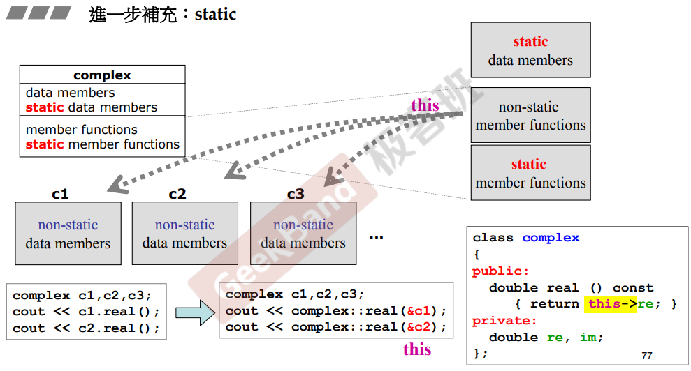
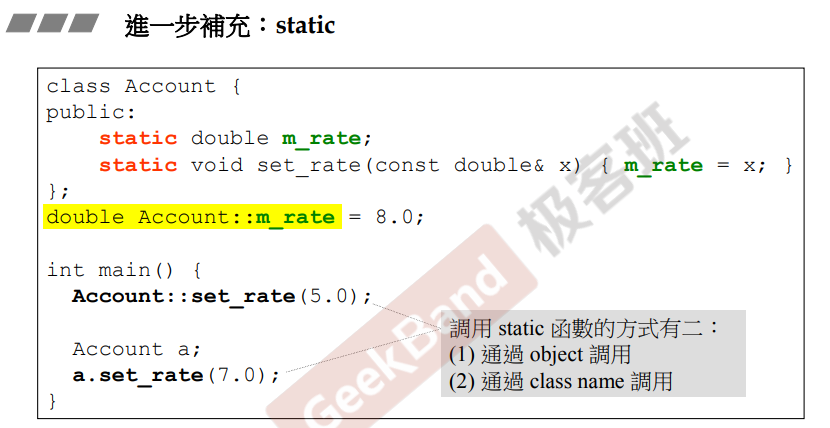
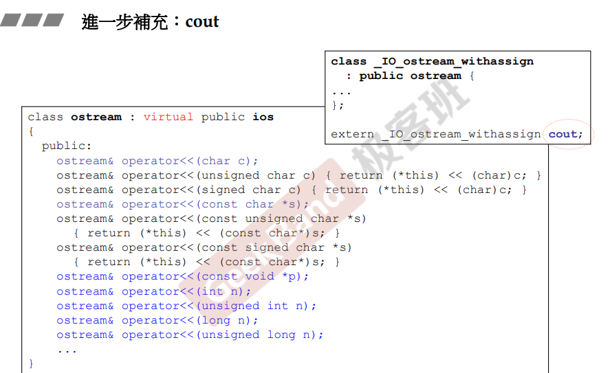
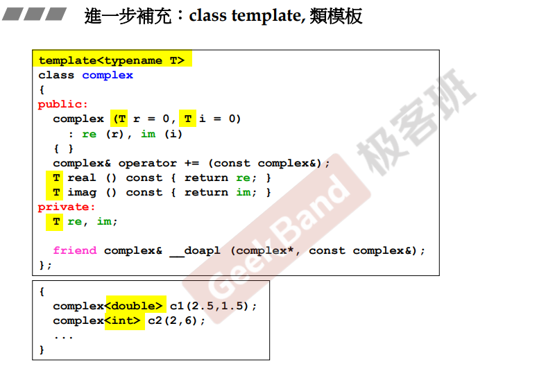
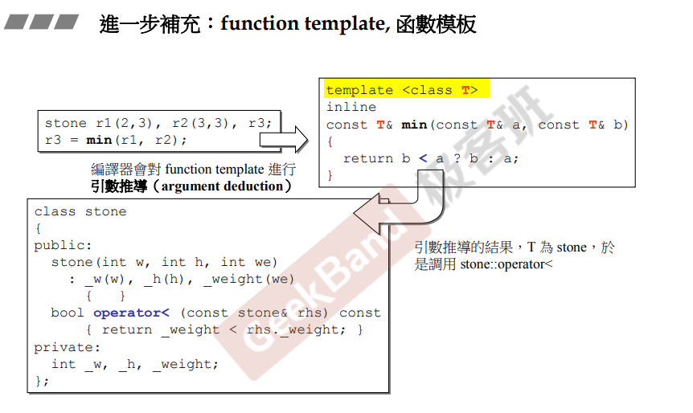
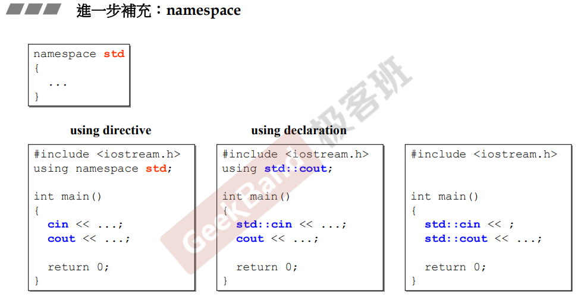

## 简介

补充一些之前课程中的一些没有讲过，或者说没有详细介绍过的一些关键字。

## static

在 [8.堆、栈与内存管理](8.堆、栈与内存管理) 中，简单介绍了static 对象的声明周期，但是没有对**类内static**进行详细介绍。

### 底层运行逻辑（this 指针）

如上图，创建三个 complex 对象 c1, c2, c3，他们在内存中是独立存在的，可以通过每个对象的 real() 成员函数获取对象的成员。

#### this指针

在 c 语言的角度中，调用某个对象的成员函数，这个过程相当于是是调用了一个 real(const conplex& c) 函数， 哪个对象调用，则把哪个对象的地址传入；同理，在 [5.操作符重载与临时对象](5.操作符重载与临时对象) 中介绍，<u>*每个类的成员函数的参数集中默认会有一个 **this指针**，所以在 c++ 的角度中，每次调用成员函数，相当于将对象作为 this 指针传入这个函数中*</u>，如上图( complex::real(&c1) )。

**关于 <u>this指针</u>，在成员函数作用域中，调用类成员时可以不写 <u>this-></u> （黄色部分），编译器会自动进行添加。**

<u>*通过 this指针，成员函数才能获取对象的成员。*</u>

#### static

##### 成员

当成员为static时，<u>这个成员便跟**对象脱离开来，不属于任何对象**，在内存的某个位置，并且只有一份。</u>

##### 函数

当成员函数为static时，<u>该成员函数就**不包含 this指针**，因此不能够在函数体内操作成员（通过 this 指针获取）</u>，只能够去操作静态的成员。

### 声明与调用

关于静态成员的声明，必须要进行定义初始值（如上图，黄色部分）。

关于静态函数的调用，有两种方式：

> 1.通过对象调用
>
> ​	与一般的成员函数相同
>
> ​	**注意：由于是静态函数，所以编译器不会将对象作为this指针传入**
>
> 2.通过类命调用
>
> ​	在没有（无法获取、暂时没有）对象时，可以通过类命直接调用静态函数。

## cout

对于 cout ，这里解释一下为什么 cout 可以对很多不同类型的数据进行输出。

如上图，可以看到，cout 其实是一种 ostream（输出流），在 ostream 中，重载了许多 << 操作符，并且接收了很多不同类型的数据，所以才能将不同类型的数据输出出来。

## 类模板

在之前设计复数 [2.头文件与类声明简介](2.头文件与类声明简介) 类中，简单的提到了类模板。

当类中有成员类型不确定时，可以使用模板类，同时声明一个 typename（类型名）来声明这个类为一个模板类，如上图。

在使用模板类时，需要绑定一个类型，**在绑定完成后，编译器会将模板类的类型全部替换为绑定的类型，并且生成一个对应绑定类型的类**。因此，<u>*使用模板类会导致代码膨胀，但是这是必要的。*</u>

## 函数模板

类似于类模板，函数也可以定义为模板，用于不同类型但是操作相同的函数的定义。

区别于类模板的是，**函数模板有时不必绑定类型，可以进行实参类型推导，得到一个对应类型的函数。**

**注意：如上图，当需要为 stone 类使用 min 模板函数时，*<u>需要进行 < 操作符重载</u>*，否则编译器无法进行 min 函数的调用，因为在该函数中本质上是 < 对比的结果。**

## namespace

命名空间，通过声明一个 namespace，在这个命名空间中，可以避免遇到重命名导致编译出错的问题。

关于命名空间的使用：（上图下半）

> 1.使用 **using namespace关键字**（using directive），等同于将对应命名空间全部打开，结果就是可以使用该命名空间下的所有东西。
>
> 2.使用 **using 关键字**（using declaration），等同于只使用某个定义，但是其他的不能直接使用。
>
> 3.任何都不 using，直接通过命名空间获取。