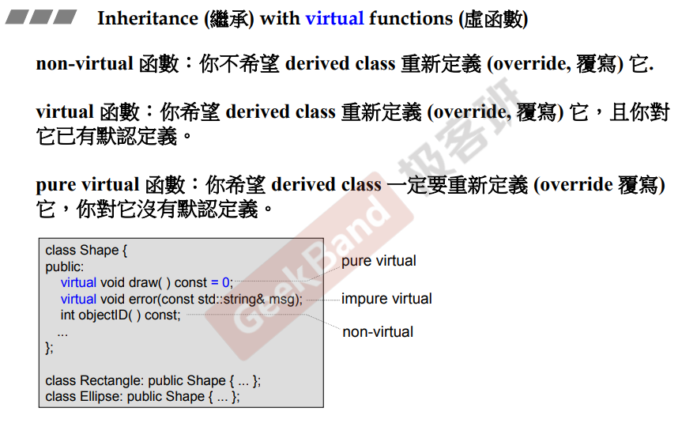
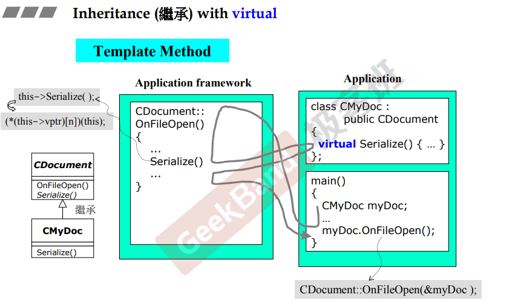
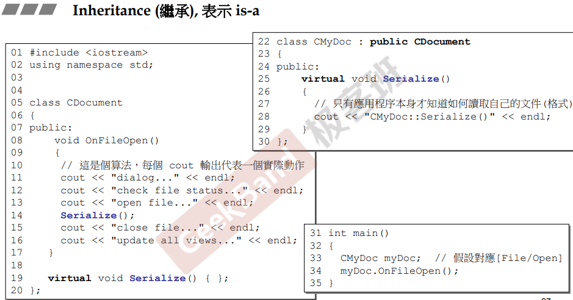

## 简介

当使用继承时，一般需要搭配虚函数来使用，才能达到继承最希望的效果。

具体的语法为在成员函数前添加 virtual 关键字。

## 基类成员函数

如上图，从继承的角度来看，如果要设计一个基类，那么这个类的成员函数一般分为**三种**：

> 1.**非虚函数**：这种函数<u>*不希望子类去重新定义它*</u>。
>
> 2.**虚函数**：这种函数<u>*希望子类去重新定义，且基类自身已有定义*</u>。
>
> 3.**纯虚函数**：这种函数<u>**必须**子类去重新定义，基类不去定义</u>。

## 虚函数

如上图，基类CDocument 中，有一个 OnFileOpen 函数，这个函数的工作是打开文件，该函数包含了类似获取文件名、检查文件、打开文件等操作。作为基类，无法确定不同类型的文件应该如何打开（Serialize），所以这个方法应该由子类去实现（虚函数）。

在子类 CMyDoc 中，实现了Serialize方法，并且在 main 函数中，调用了该对象的 OnFileOpen 方法，该方法是基类实现的方法，并且调用了 Serialize，<u>***由于该方法为虚方法，则调用时会去调用 CMyDoc 类的实现***</u>。这种用法被称为模板方法（template method）

### 进一步解释

在调用 OnFileOpen 时，对象 myDoc 会作为 this 指针传入成员方法中，那么在 [10.一些补充](10.一些补充) 中提到，成员函数中调用成员时，编译器会自动添加 this-> 指针，然后就调用了 MyDoc 类的实现（<u>在这里侯捷老师没有过多的解释，只是简单的说了下， **(*(this->vptr)[n])(this)**; 这一行没有详细解释</u>）。

**注意：该方法<u>*必须为虚方法*</u>，否则在调用 OnFileOpen 时，由于该方法没有实现，并且 Serialize 不是虚方法，所以调用结果均为父类的实现（即 Serialize 调用了父类实现）**

如下图，可以看具体实现的例子。

