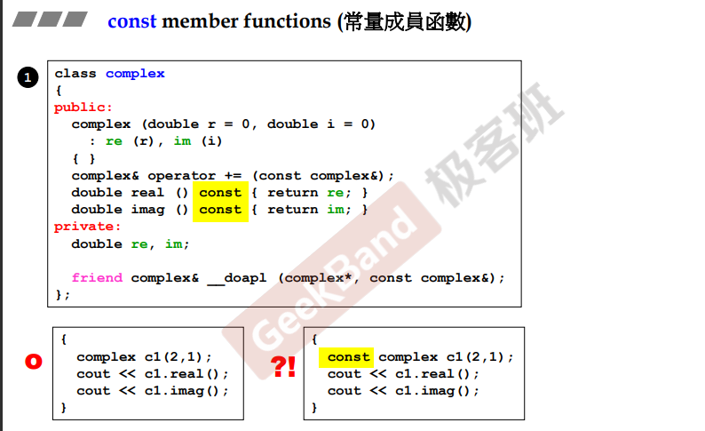
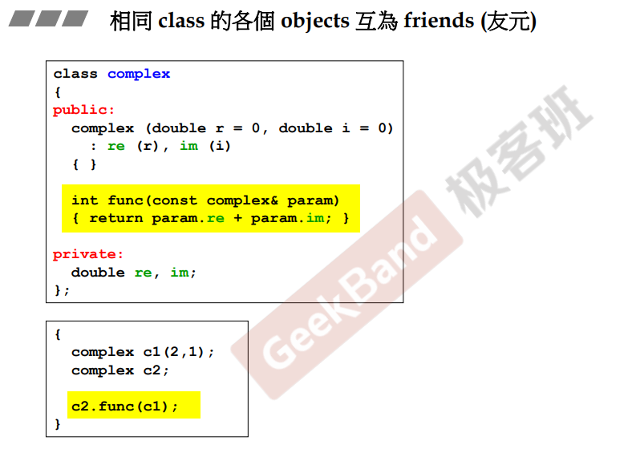

## 常量成员函数

在一个类中，成员函数一般分为两种：第一种为改变数据的函数（写入）；第二种为不会改变数据的函数（读取）

当成员函数不改变类成员时，需要将成员函数声明为常量成员函数（const）。

**<u>注意</u>**：**当一个对象声明为常量时（const），该对象只能调用常量成员函数，如上图右下。所以，声明常量成员函数是非常有必要的**

## 友元函数

当在类中使用 <u>*friend*</u> 关键字声明了一个函数时，**该函数可以直接访问类成员**，如上图的<u>*__doapl*</u> 函数，可以直接方位 complex 类型对象的私有成员。速度上比通过函数访问成员要快。

**友元的一些特性**：**相同类型（class）的各个对象（objects），互为友元**

如上图，在类 complex 中的 func 函数，可以直接访问 complex 类型对象的私有成员。