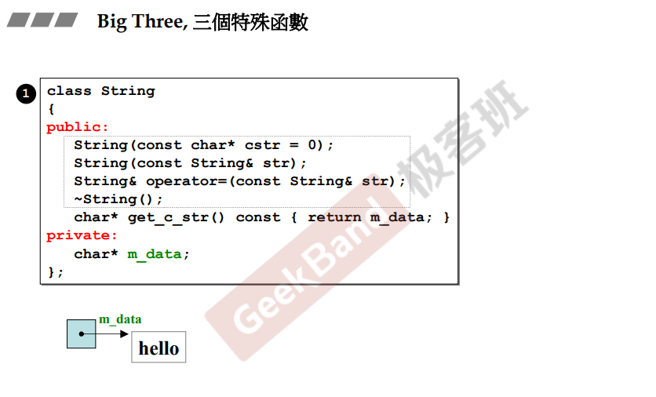
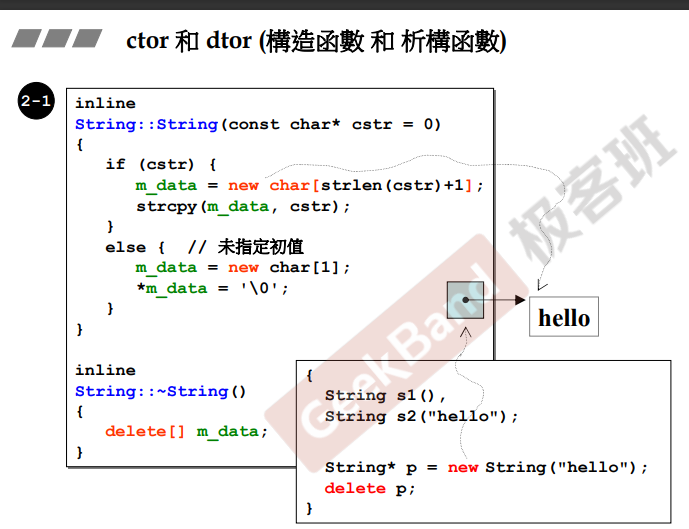
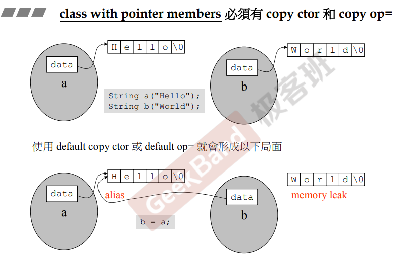
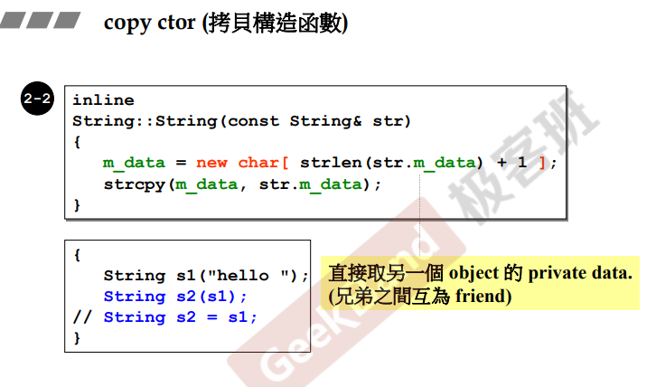
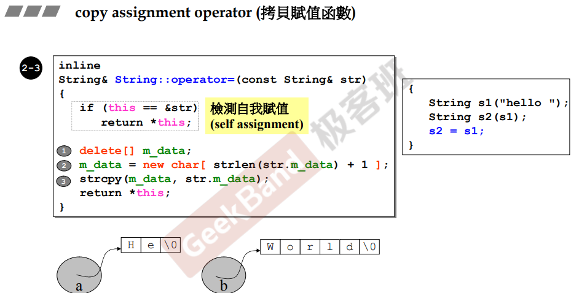
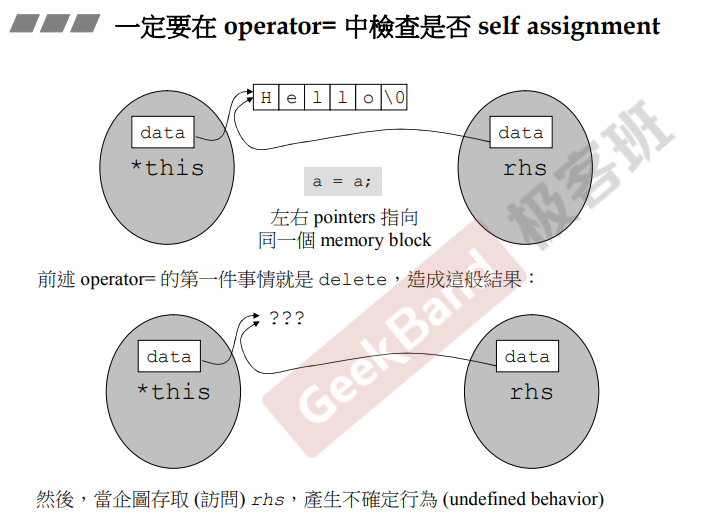

## 简介

在本系列课程中曾经强调，类根据成员类型，可以分为两大类：第一类的成员中不包含指针；第二类的成员中包含指针。

后者相较于前者来说，需要考虑成员拷贝赋值、拷贝构造以及释放的动作。

在之前的课程中（complex类），成员中不包含指针，编码时也没有对上述三类函数进行编写。这时，编译器会自动帮我们提供，例如拷贝相关：<u>***这种函数的方式就是以字节为单位去拷贝（复制）对象中的成员（每个成员依次拷贝）。***</u>无论怎么设计，其实跟编译器默认给出的是同样的效果，所以不需要重新编写。

## 指针类型类成员

如上图，以string类（字符串）为例，其实现是通过一个char（字符）的指针，来实现字符串相关功能。

含有指针类型的成员的类，一般需要新增加三个特殊函数（虚线框）：**拷贝构造（二）、拷贝复制（三）以及析构函数（四）。**

## 构造函数与析构函数

### 构造函数

根据传入的参数（char *），根据数据长度，动态分配一个字符数组的内存（new char[]），并且让成员指针指向这段内存，并且将参数的内存拷贝到这段内存中。

**注意：字符串的结尾是 '\0' 字符，表示结束，所以长度需要 +1**

### 析构函数

<u>*析构函数在类的声明周期结束（离开作用域、手动释放）时进行调用。*</u>

由于 string 类成员中指向了动态分配（new）的内存，所以在类生命周期结束后，需要手动释放（delete）分配的内存，否则会内存泄漏。

## 拷贝

当类成员中需要动态分配内存（指针类型成员），除了需要析构函数外，必须要重写拷贝相关函数（构造、赋值）

### 重写拷贝的底层原因

如上图，创建了两个string对象，当进行拷贝赋值操作 <u>**b = a**</u> 时，根据编译器的默认拷贝赋值函数，<u>直接将成员指针进行赋值，这时两个对象的指针成员指向了同一段内存</u>，引出了两个问题：<u>***第一个问题是内存泄漏，拷贝的对象指向了被拷贝的内存，但原先内存未释放；第二个问题是当两个对象释放内存时，会出现同时释放同一段内存的异常。***</u>

上述的现象则被称为**浅拷贝**

### 拷贝构造

在真正的拷贝构造中，**需要将被拷贝的对象指向的内存进行拷贝，在将自己的指针成员指向这段内存**。而不是简单的赋值指针（浅拷贝）。

### 拷贝赋值

拷贝赋值的操作，根据上述原因，真正的操作为：**先释放自身动态分配的内存，然后类似拷贝构造函数，分配一段跟赋值对象相同的内存，并且将指针成员指向这段内存。**

#### 检查是否自我赋值

当使用者进行自我赋值时，不只是对效率进行优化（避免分配内存），<u>***更重要的是，若进行拷贝赋值，第一步的操作是释放掉指向的内存，当进行到第二步根据被拷贝对象分配内存时，会引起程序异常，原因是这段内存已被释放***</u>（真的有人这么用吗😓）。

**所以在拷贝赋值中进行是否自我赋值的检查是非常有必要的。**