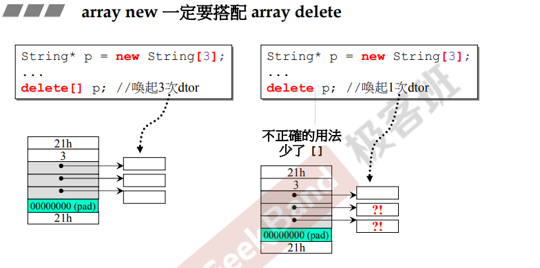

## 简介

**栈（stack）**：存在于**某个作用域（scope）的一块内存空间**。例如，调用函数时，函数自身（作用域）就会形成一个stack，这个stack可以放置**接收的参数、域中变量以及返回地址**。

如上图，对象 <u>*c1*</u> 的创建是在stack中（作用域内）。

**堆（heap）**：指**操作系统提供的全局内存空间**，程序可以动态分配这些内存。

如上图，对象 <u>*c2*</u> 的创建是在heap中。

## 对象生命周期

### 栈 stack 对象

当一个对象在栈中，**当对象离开作用域后，对象生命周期结束，析构函数被调用**。

### 静态 static 对象

同样在栈中，但是**作用域结束后仍然存在，程序结束后才会消失**。

### 全局对象

跟上述的静态对象相似，但是是**声明在全局作用域，所以<u>作用域为 "整个程序"</u>，所以生命周期同样为整个程序**。

### 堆 heap 对象

对象被声明在堆内存中，**只有在 <u>delete</u> 时，对象生命周期才会结束，析构函数才会被调用**。

在上图中，指针 p 指向了一块动态分配的内存（heap），*<u>在作用域结束后，指针消失，但是指向的内存没有消失</u>*。处于堆内存的中对象需要进行手动回收，否则会造成内存泄漏。

## 堆内存（动态）

### 堆内存分配详解

当动态分配内存（new）时，会得到一块足够大的内存空间，然后在调用类的构造函数得到对应对象。

编译器会转化为以下步骤：

> 1.分配内存（operator new）
>
> ​	**实际上是调用 c 语言中的 malloc**，得到的内存大小为类型的大小（sizeof）
>
> ​	如上图，<u>*分配出来的内存为两个double大小*</u>，并得到起始位置（pc）
>
> 2.类型转换（static_cast）
>
> ​	将得到的内存类型转为对应的类（先简单介绍）
>
> 3.调用构造函数

### 堆内存释放详解

当销毁对象（delete）时，会先调用类的析构函数，然后再释放内存空间。

编译器会转化为以下步骤：

> 1.调用析构函数
>
> 2.释放内存（operator delete）
>
> ​	**实际上调用的是 c 语言中的 free 方法**

**注意：**

**在上述的类 complex 中，成员内部没有动态分配的内存，所以当调用析构函数时，<u>*只是简单的将空间进行回收，调用的析构函数为编译器默认提供的析构函数（不做处理）*</u>。**

**若成员中含有动态分配的内存，析构函数的作用就得以体现，<u>*需要先将成员中的堆内存进行回收，然后再去回收对象的内存*</u>。**

### 动态分配内存的大小

在不同的编译器，不同的模式下，对象分配的内存并不是对应类的所有成员大小之和，而是还包含这其他的的内存块。

以vc编译器为例：

#### 调试模式

如上图，若要分配一个 <u>*complex*</u> 类，首先该类的大小为<u>**两个double（8个字节**</u>？一般为16，可能侯捷老师的操作系统或编译器区别，这里使用8个字节）；同时，在该模式下，会得到 **<u>8 * 4 （顶上灰色）以及 1 * 4（底下灰色）的内存</u>**（<u>***这两块内存不管在哪个模式中都是必要的***</u>）；并且需要**<u>两个cookie（首尾红色）的内存</u>**。

总共会得到 <u>*8 + 32 + 4 + 8 = 52*</u> 个字节，**<u>在vc编译器下，每块内存需要保持在16的倍数</u>**，最靠近 52 的 16 的倍数是 64，所以需要填充几个**pad（绿色）**的内存，让其达到64个字节。

对于 <u>*string*</u> 类，成员只有**一个指针（4个字节）**，分配的模式类似。

#### Release（非调试）模式

由于 cookie 是必要的，所以在非调试模式下，对于 complex 类，会得到 8 + 8 = 16，为16的倍数，所以不需要分配pad内存。

#### cookie的用处

**cookie用于记录分配的内存块的大小**。

在 c++（c语言）中，分配完内存之后只会得到一个指向内存块头部地址的指针，在释放时需要知道内存块大小，所以通过cookie得到内存块的大小，并且进行释放。（malloc / free）

如上图：在调试模式下的 complex，他的 cookie 为41（hex），在十进制下即为65，<u>***在十六进制中多 1，这多出来的 1 的作用表示内存的给出与收回***</u>。当程序获得内存（即系统给出内存），则多1。

<u>***所以，这样就解释了为什么vc分配内存需要保持 16 的倍数（16进制下最后一位为0）。***</u>

#### 数组分配

如上图，假设需要分配大小为 3 的 complex 数组，跟单独动态分配中编译器固定分配内存（cookie、debugger header、pad）相同；<u>不同的是，需要在其中分配三个 complex 对象的大小（3 * 8）</u>。

<u>***注意：当动态分配数组（array new）时，同样需要使用array delete，否则只会唤起一次delete，可能导致内存泄漏，如下图***</u>

**再注意：内存泄漏并不指的是分配的内存，而是<u>数组中剩余对象的*动态分配的内存*会引起泄漏。</u>** 深层的原因是，调用一次delete，<u>*只会调用第一个对象的析构函数，然后将整个分配的内存回收（cookie包含的内存），而其他对象的析构函数不会被调用，但是内存被回收了*</u>。

所以，若类中成员不动态分配内存，则不会引起内存泄漏。

