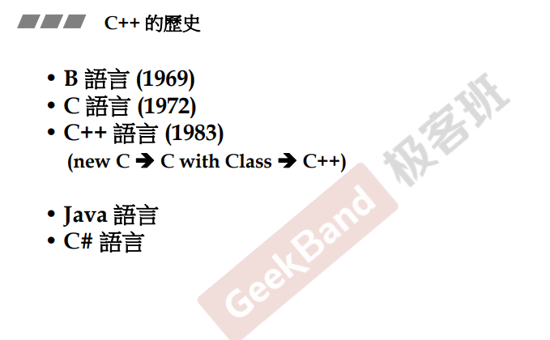
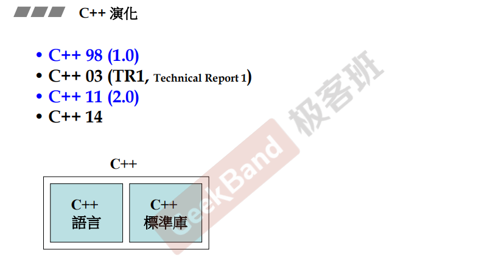
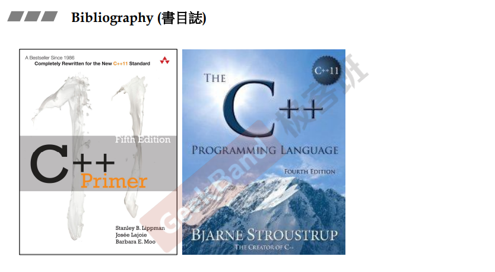
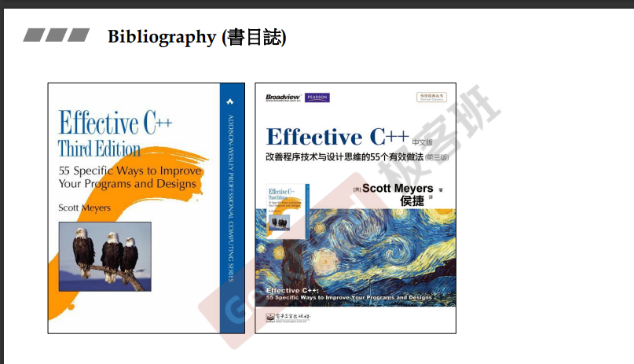
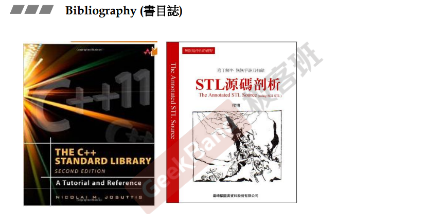

# Getting Start

##  简介

> 在本文档中， 是对**侯捷老师**的 **c++面向对象高级开发** 课程的一些总结
>
> 所有内容均为自身理解

## c++历史及其组成

首先介绍一下c++的发展历史， 由于该教程录制时间为2015年， 所以介绍的c++版本为c++98以及c++11。 c++14在当时也有， 但只是一个小更新（测试用）， 在该系列课程中并未过多赘述。 下面放上c++的发展历史图： 

可以看到， c++的最主要的构成：**c++语言** 以及 **c++标准库**， 在使用集成开发环境（visual studio 😓）时， 编译器会根据环境去寻找对应安装路径的目标文件（倒不用关心）

## 推荐书籍

### 语言篇：

最常用的应该就是《c++ Primer》了，这本书的第五版介绍了c++11的标准，是一本不错的c++百科全书，是第一个c++编译器的作者写的，比较权威

### 进阶篇：

这里侯捷老师给自己的作品《Effective c++》打了波广告🤭，据介绍说这本书主要是当掌握了c++的基本用法之后，需要一些专家介绍说怎么去用好c++，如何巧妙去使用c++时，可以参考的书籍。

### 标准库：

同样的，侯捷老师推荐了自己的作品（右），深入的剖析stl的源码，左边的书籍同样也不错，非常全面的介绍了c++的标准库。

