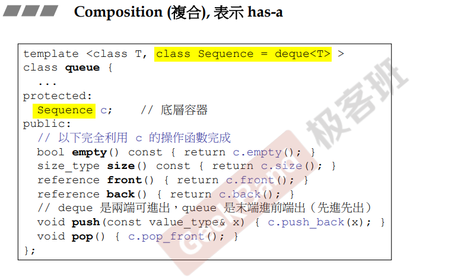
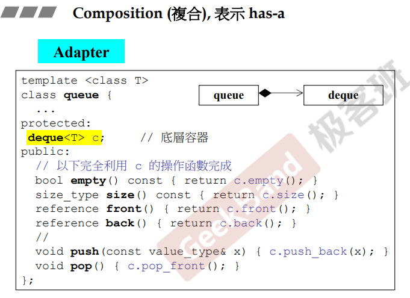
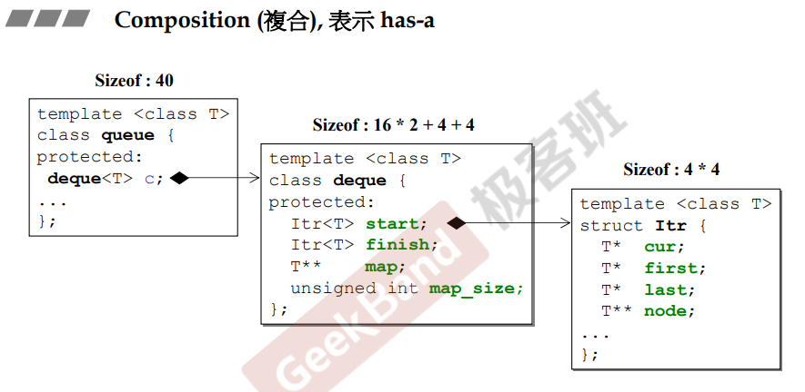
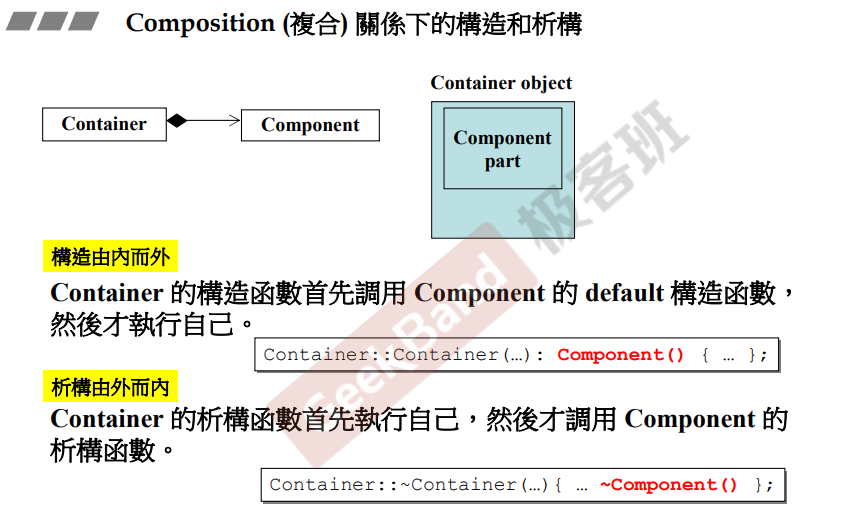
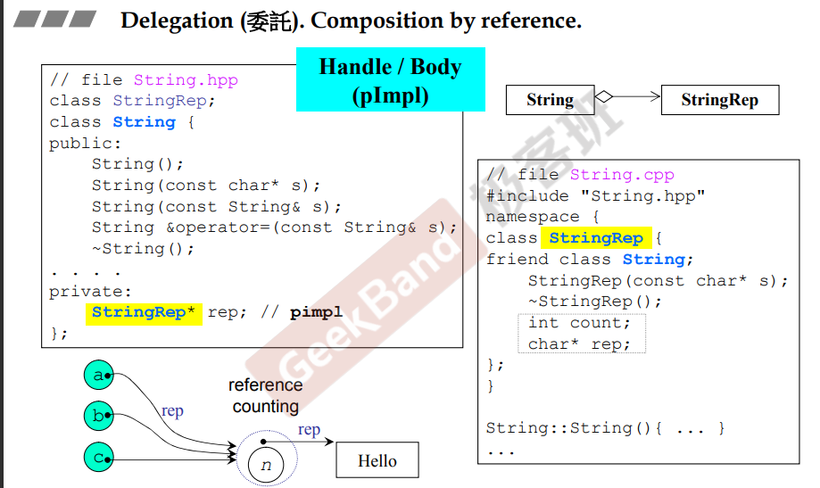
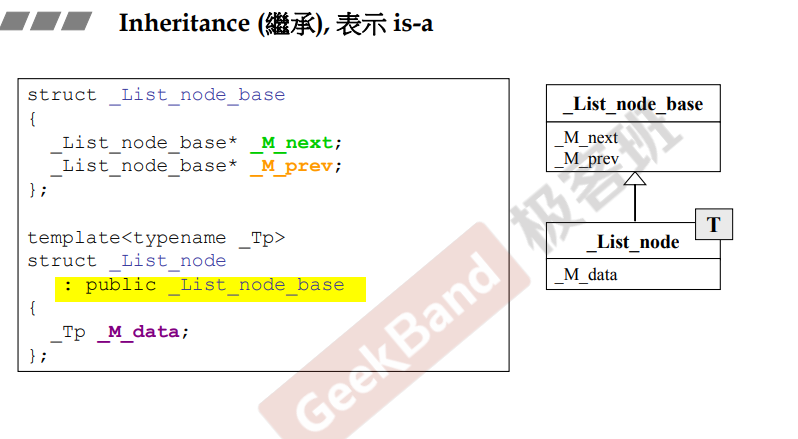
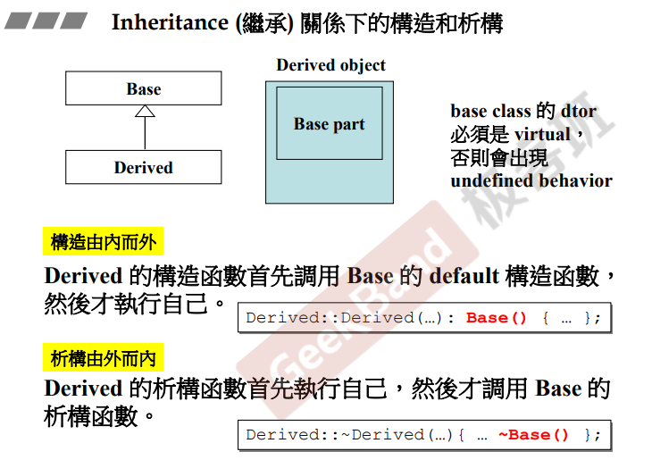

## 简介

在面向对象的程序（object oriented programming）和面向对象的设计（object oriented design）中，<u>*最常用的类跟类的设计关系有**组合、继承、委托**。*</u>

## 组合 composition

如上图，这是一个标准库的例子 queue 类。

该类里面有一个成员 Sequence，该成员默认的类为 deque（黄色部分）。这种就是组合，具体表现为：**<u>*一个类中，有一个（has a）别的类型成员*</u>**。如下图，<u>*queue 中含有一个 deque 类型的成员（黑色菱形）*</u>

可以看到（上图），queue 的所有功能，都是<u>*基于 deque 进行实现，并且没有新增的其他功能（queue 先进先出，deque 可以两端进出）*</u>，这是一种特例。当出现这种设计时，通常把这种设计称为 **适配器（adapter）模式**。

**注意：并不是所有的组合都必须类似 queue**

### 内存角度

如上图，沿用 queue 的例子，可以看到在 queue 在组合了 deque 后，内存大小其实跟 deque 的大小相同，为 40 个字节。

### 构造与析构

如上图，在组合的情况下，相当于有一个容器（container），被组合对象为（component）。

那么在**构造**时，<u>*需要先构造内部的 component，然后再去执行自身的构造函数，即**构造时需要由内而外**。*</u>（红色部分）若在初始化列表中没有编写，那么编译器会自动添加内部 component 的默认无参构造函数。

在**析构**时，<u>*需要先执行外部（container）的析构函数，然后再去调用内部类成员的析构函数，即由外而内。*</u>同理，红色部分在不编写的情况下编译器会自动添加。

## 委托 Delegation

跟 composition 组合模式类似，是一种基于引用关系的组合（**composition by composition**），<u>*具体体现为类中有个其他类的成员指针*</u>，如上图（空心菱形）。

对于与 composition 的区别在于：*<u>delegation 形式的类，被委托者跟委托者的生命周期不一定相同；而 composition 形式的类，组合者和被组合者的声明周期一致，一起生成，一起销毁。</u>*

另外，如上图左下，**delegation 可以共享内存，被共享者可以进行引用计数（reference counting）。共享的好处可以节省内存。**当然需要注意的是，当一个对象想更改共享内存的值，但是不影响其他的引用者，**这是需要拷贝一份去进行更改，另外的对象依然引用共享内存，这种操作被称为  <u>*[copy-on-write]()*</u>**。

## 继承 Inheritance

如上图，继承关系的语法（黄色部分），通过一个 ": " 加上被继承的类（一般用public）来表示继承。一般用空心三角形表示（子类指向父类，上图右侧）。使用 public 继承，表示为 is-a（是一种）。

### 构造与析构

从内存的角度看，子类的对象中，有父类的成分（part）在内（感觉有点像composition）。

类似的，构造时由内而外，析构时由外而内。即<u>*构造时先调用父类的构造函数，然后再执行子类的构造函数（红色部分），没写依旧是编译器自动给出；析构函数同理，先执行子类的析构函数，再去调用父类的析构函数，编译器当然会自动给出。*</u>。

**注意：父类的析构函数必须是 virtual 虚函数。** *（后面讲解~）*

