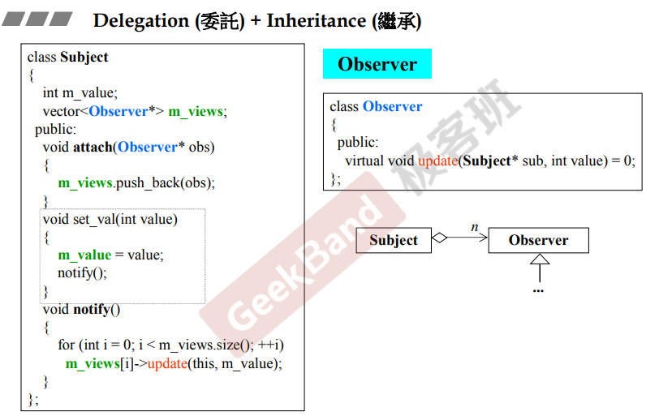

## 简介

当使用继承时，一般需要搭配虚函数来使用，才能达到继承最希望的效果。

具体的语法为在成员函数前添加 virtual 关键字。

## 基类成员函数

如上图，从继承的角度来看，如果要设计一个基类，那么这个类的成员函数一般分为**三种**：

> 1.**非虚函数**：这种函数<u>*不希望子类去重新定义它*</u>。
>
> 2.**虚函数**：这种函数<u>*希望子类去重新定义，且基类自身已有定义*</u>。
>
> 3.**纯虚函数**：这种函数<u>**必须**子类去重新定义，基类不去定义</u>。

## 虚函数

如上图，基类CDocument 中，有一个 OnFileOpen 函数，这个函数的工作是打开文件，该函数包含了类似获取文件名、检查文件、打开文件等操作。作为基类，无法确定不同类型的文件应该如何打开（Serialize），所以这个方法应该由子类去实现（虚函数）。

在子类 CMyDoc 中，实现了Serialize方法，并且在 main 函数中，调用了该对象的 OnFileOpen 方法，该方法是基类实现的方法，并且调用了 Serialize，<u>***由于该方法为虚方法，则调用时会去调用 CMyDoc 类的实现***</u>。这种用法被称为模板方法（template method）

### 进一步解释

在调用 OnFileOpen 时，对象 myDoc 会作为 this 指针传入成员方法中，那么在 [10.一些补充](10.一些补充) 中提到，成员函数中调用成员时，编译器会自动添加 this-> 指针，然后就调用了 MyDoc 类的实现（<u>在这里侯捷老师没有过多的解释，只是简单的说了下， **(*(this->vptr)[n])(this)**; 这一行没有详细解释</u>）。

**注意：该方法<u>*必须为虚方法*</u>，否则在调用 OnFileOpen 时，由于该方法没有实现，并且 Serialize 不是虚方法，所以调用结果均为父类的实现（即 Serialize 调用了父类实现）**

如下图，可以看具体实现的例子。

## 继承和组合

如上图，

<u>在*上半部分*，子类继承父类，并且组合了一个component，当创建了一个 Derived 类型对象时，从内存结构看，有一个父类和一个被组合类（component）的内存</u>；

<u>在*下半部分*，父类组合了一个component，子类继承自父类，那么在创建一个子类对象时，它的内存结构为一个父类部分，父类中有被组合类（component）部分。</u>

> *那么，各自的构造与虚构应该按怎样的顺序执行呢？*

显而易见，在后者（<u>*下半部分*</u>）中，构造函数由内而外，**先执行最内层的component的构造函数，然后到父类，最后到子类，析构函数则相反**，可参考 [11.组合与继承](11.组合与继承) 中的组合标题；

而在前者（<u>*上半部分*</u>）则相反，**先执行的是父类的构造函数，然后是component，最后是子类，析构则相反**，如下图。

> 这里具体原因侯捷老师并没有解释，只是让我们去尝试。

## 委托和继承

如上图，这是一个经典的设计模式，称为**观察者模式**（observer）。

该模式的实现，通过 <u>*subject 委托 observer 类的一些对象*</u>，并且通过 *<u>实现不同类型的 observer（继承）</u>*来实现。这里的 subject 理解为数据，被附加（attach）到 subject 的 observer 根据数据，来更新自身的一些属性。

subject 中的 **notify 函数**会通知 observer 去更新属性（调用update），这时就用到了上述虚函数的特性，基于 observer 实现的类，在调用 update 时会根据自身实现进行调用（这个根据笔者经验，应该是有关多态指针的特性，但课程中侯捷老师没有细讲，估计在后面）。