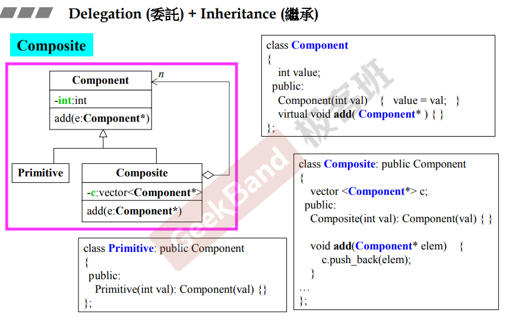
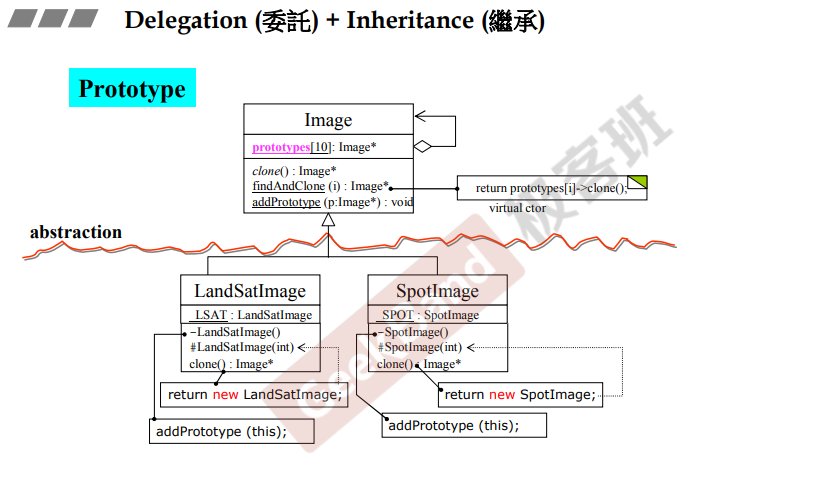

## 简介

本节课时part1的最后一堂课，在这堂课会介绍到一些设计模式，这些设计模式通常使用了 Delegation + Inheritance（委托 + 组合）的类关系。

## Composite 组合

在《设计模式》这本书中提到 composite 设计模式适用于对象的树形组合，以表示 "部分---整体"的层次结构。**composite使得的用户对<u>*单个对象*</u>和<u>*组合对象*</u>的使用具有一致性**。

如上图，composite 为组合类（拥有指向component的指针容器），<u>它本身继承自 component，并且可以添加 primitive 类（component子类，一般为单个对象）和 composite 类（本身，组合对象）</u>，所以composite对象的特性使得用户对单个对象和组合对象的使用具有一致性。

> *在这里侯捷老师举了个实现文件系统的设计例子。这个例子中，<u>目录便是组合对象，而文件就是单个对象</u>*

## Prototype 原型

《设计模式》中提到，原型设计模式是通过拷贝原型对象来创建对象。这里还是比较抽象，在侯捷老师的解释中：<u>*当要创建的对象是后来才会有，不改变原有框架的情况下（如上图，继承自 Image 类的子类），则可以通过该设计模式，在设计完子类后，通过 addPrototype 以及 clone 来创建出后面的原型对象。*</u>

如上图

> 1.在子类中<u>*放置一个自己类型的静态对象*</u>（下划线，如<u>LAST</u>），**（注意：画类图时与编码时的类型和变量名相反，先变量名，后类型。另外，<u>函数前 + 代表public，- 代表 private，# 代表 protected</u>）**；
>
> 2.然后，若想让父类以及其框架使用到这个子类，<u>*需要准备一个空间，来放置这些子类对象*</u>（ 如上半，prototypes[10] ）；
>
> 3.可以看到，子类的构造函数为私有的，在第 1 步中的静态对象可以调用私有的构造函数，并且<u>*在这个构造函数中调用 addPrototype 将自己添加到第 2 步的空间中*</u>。
>
> 4.在父类和父类框架中，<u>*调用 prototypes 中的 clone 来获取子类对象（即 Prototype 中的 findAndClone 函数）。*</u> **注意：在调用clone时，<u>*不能去调用默认的构造函数，否则会再去调用一次 addPrototype，需要在设计一个构造函数*</u>，来于默认的构造函数做区分。**

## 结语

在第一部分课程中，简单介绍了类的设计，以及类之间的三大关系，并且阐述了几种设计模式，来对这三种关系的使用有一个初步的认识。