## 数据和函数

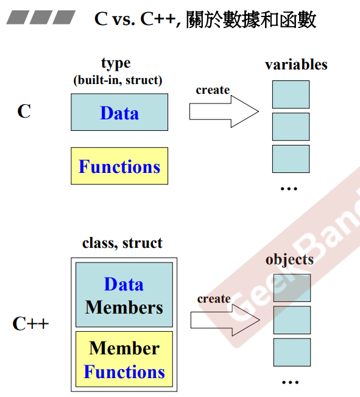

在c语言中，数据和函数基本上是分离的，数据由一个个的基本类型（或结构体）进行存储，函数则对这些数据进行处理（variables）。这导致在程序中几乎所有的数据都是全局可访问的，所有的函数都可以对任何数据进行处理。

作为第一种最有名的面向对象的语言，c++将数据与处理这些数据的函数包在一起（class），只有一些函数能够处理某些数据，其他的函数访问不到这些数据。它的使用是通过声明一个个的类型（class），通过这些类型创建一个个的对象（object）

> 特别标明：
>
> 在类的设计中，成员内是否还有指针是存在比较大的区别
>
> - 若成员中**不含有指针**，这数据是存储在这些成员内部，对象的内存大小决定于这些成员的大小
> - 若成员中**含有指针**，那么这个类的内存大小就为指针的大小，数据存储在别处，需要通过成员中的指针进行获取

## 头文件

### 引用头文件

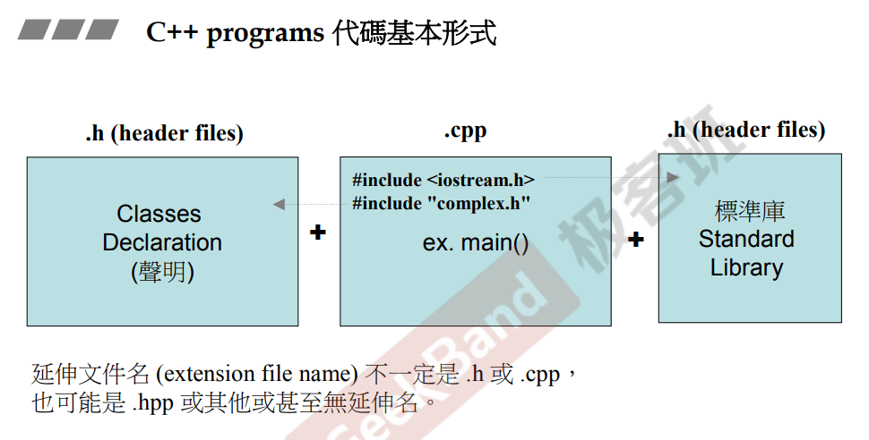

通过 #Include 进行引用，若使用<>，可以认为是放入集成开发环境的头文件（标准库）；若用""，可认为是指定路径，这个路径一般为自身工程的头文件路径

### 防御式声明

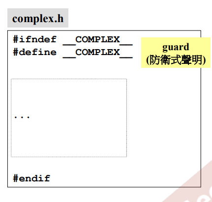

```c++
#ifndef ... 
#define ...

//todo ...

#endif

```

在上述声明中，引用该头文件时，编译器先判断是否没有声明（#ifndef），若没有声明，则进行声明（#define），然后编写头文件，最后结束判断（#endif）

这样做的好处是防止头文件重复引用，导致重定义

当然，在如今的集成开发环境（visual studio）中，#pragma once 就可以进行代替

### 头文件布局

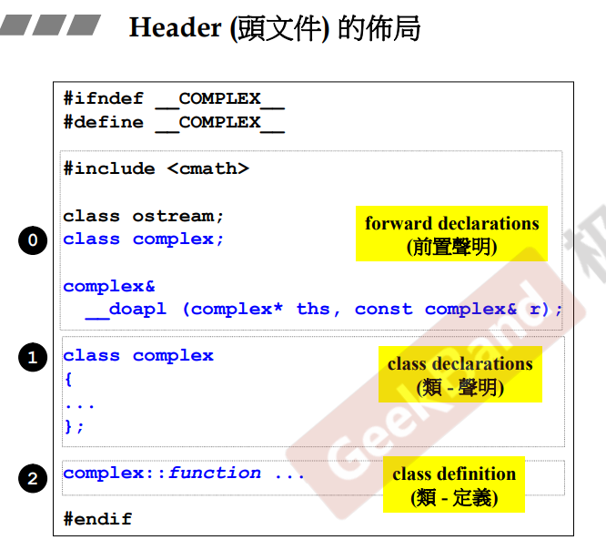

在一个头文件中，会包含

> - 防御式声明
> - 前置声明
> - 类声明
> - （某些）类定义

## 类的声明

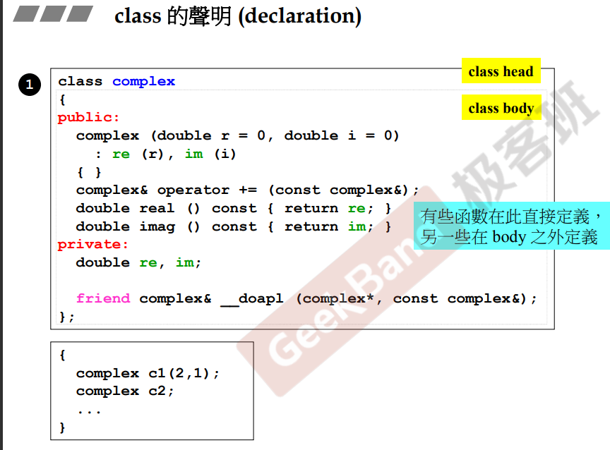

类的声明一般分为两个部分：

1. 类的头（class head），这段声明的作用是声明一种新类型（名字）
2. 类的身体（class body），声明类的成员以及成员函数，有些函数可以直接在body中定义，有些可以在外定义（cpp或类外）

## 类模板简介

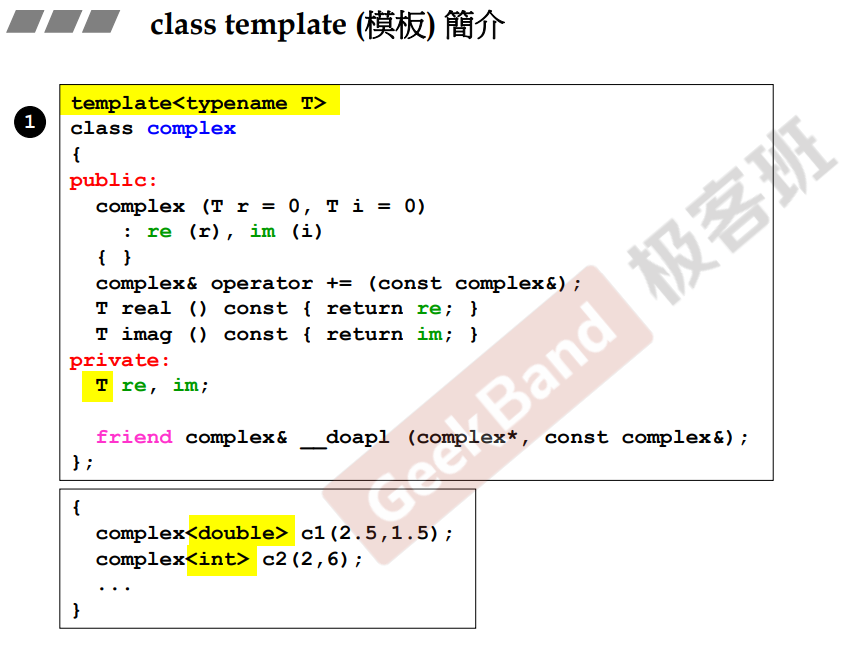

当一个类中的成员可能为不同的类型时，c++提供了一种特性，这种特性可以让编码者无需声明（定义）多种不同成员类型的类。这种特性称为模板（template）

使用模板时，需要声明一个类型名（typename），表示为在类中可能为不同类型的成员。

在上图中，成员 re, mi 可能为不同的类型，则用 typename 为 T 的类型进行声明。

## 内联 inline

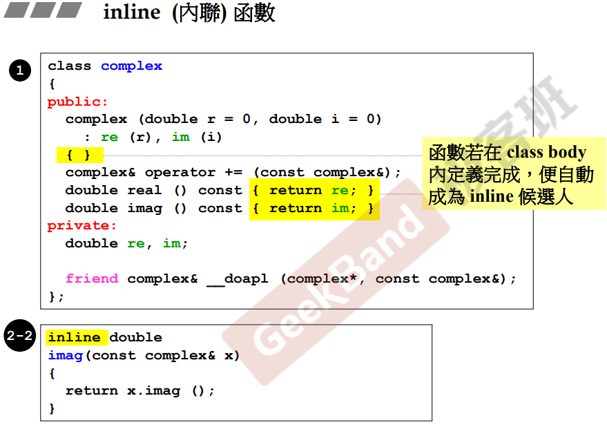

在侯捷老师的课程中，介绍内联函数inline时，提到内联函数类似c语言的宏，使用inline可以提高程序运行速度，但不是所有函数都能inline（即使声明为inline），具体判断标准没有解释，大概阐述了简单的函数编译器可将函数声明为内联，复杂的则不行

## 访问级别

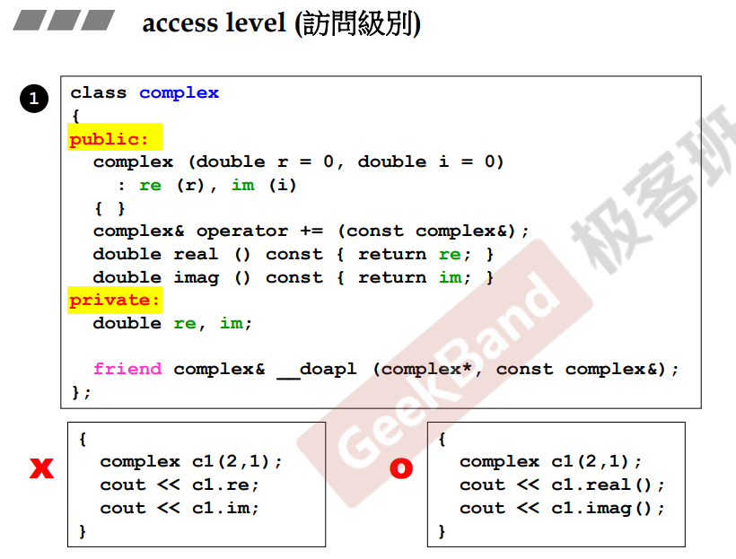

当成员 / 成员函数声明为 public 时，外界可以访问；为 private（protected未介绍）时，则不能访问

在上图中，左边试图访问类中private成员，编译阶段会报错；只能想右边那样去访问public成员

## 构造函数

在创建对象时会进行调用，有以下特点：

- 函数名称和类名相同，且没有返回类型
- 可以拥有若干个参数，并且可以拥有默认值
- 拥有初始化列表

### 初始化列表简介

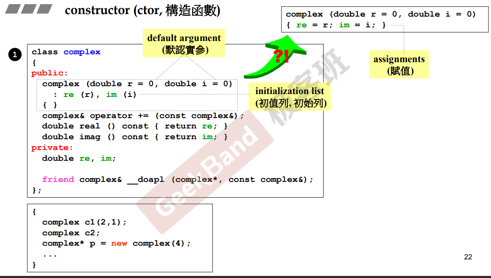

为构造函数在初始化时进行的一个动作。语法为在参数列表后添加一个 ":"，后面让成员进行初始化操作。

简单来讲，当一个变量的数值设定有两个阶段，第一个阶段为初始化；第二个阶段为赋值。当对象进行构造时，会先进行成员初始化的动作，该动作须在构造函数的初始化列表中进行；若在函数体中进行，则成员会默认初始化之后，在进行赋值，时机滞后，而且降低效率。

## 函数重载

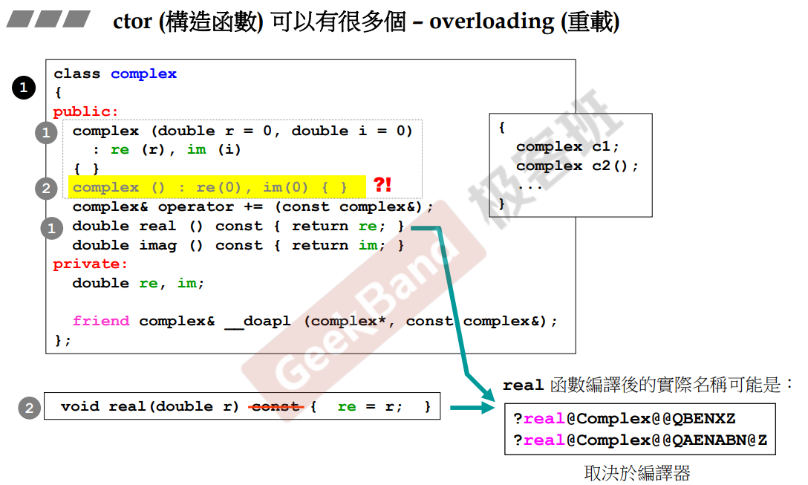

无论是构造函数，或者说是成员函数，都可以被重载。

重载的定义为：在编码时，声明并定义**相同名称但是参数不同**（这里的参数不同，特指参数的数量/类型不同）的函数（具体情况还得具体分析，可看下面的解释）。

编译器在会将函数进行重命名，例如：将拥有不同参数列表的函数命名为不同的签名，来实现函数重载（函数real）。

在上图中，重载构造函数时，由于已经拥有了一个又默认值的构造函数，**当对象在创建时**，若没有传递参数，则编译器不知道调用的是无参构造函数还是另一个构造函数，导致编译错误，<u>所以以上的构造函数重载不正确</u>。

**注意：<u>*在声明时出现上述情况，如下面的例子，编译不会报错*</u>，只有在需要创建对象的场景中：<u>*例如声明了 parent 的子类 child，在初始化时会调用父类的默认构造函数，但父类有一个有默认值的参数的构造函数，此时才会出现二义性*</u>。**

```C++
class Parent {
public:
	Parent(int a = 0) {
	}
	Parent() {
		std::cout << "Parent Constructor" << std::endl;
	}
	virtual void Func(){ std::cout << "Parent Func" << std::endl; }
	~Parent() {
		std::cout << "Parent DeConstructor" << std::endl;
	}
};

class Child : public Parent {
public:
    //在使用时, 若不进行特别的说明, 则会出现二义性错误
    // 'Parent::Parent': ambiguous call to overloaded function
	Child() /* : Parent(0) */{	//指明调用
		std::cout << "Child Constructor" << std::endl;
	}
	~Child() {
		std::cout << "Child DeConstructor" << std::endl;
	}
};
```

## 一些衍生

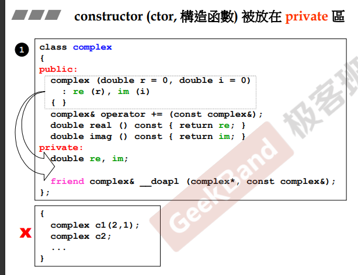

当构造函数放在private私有成员函数中时，该类型不能进行直接创建

通过这种方式，衍生出一种十分经典的设计模式，这种设计模式称为**单例**（下图）

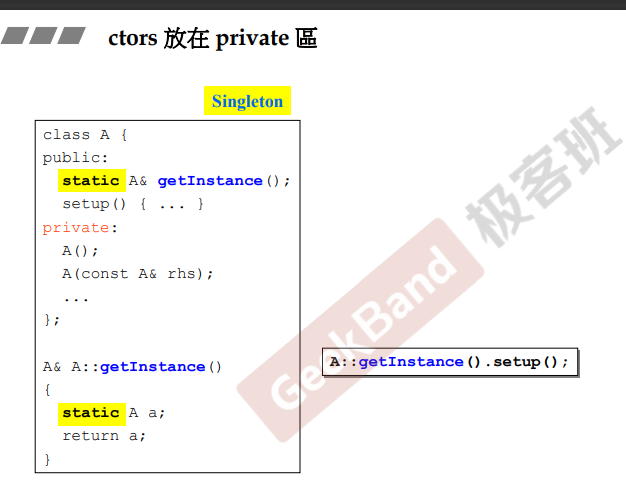

单例特指在全局中只有一个该类型的对象，该对象存储在类成员中，是个static静态成员，通过一个静态公有的接口进行访问。