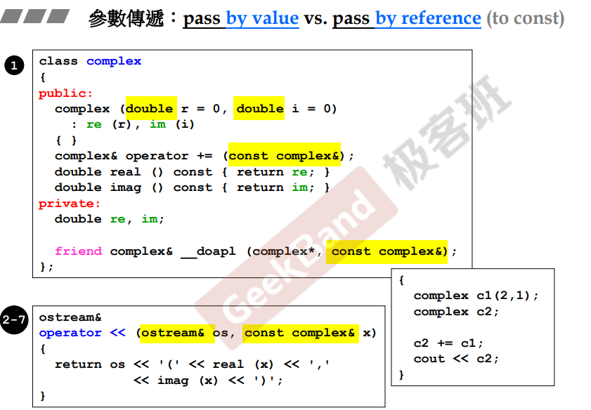
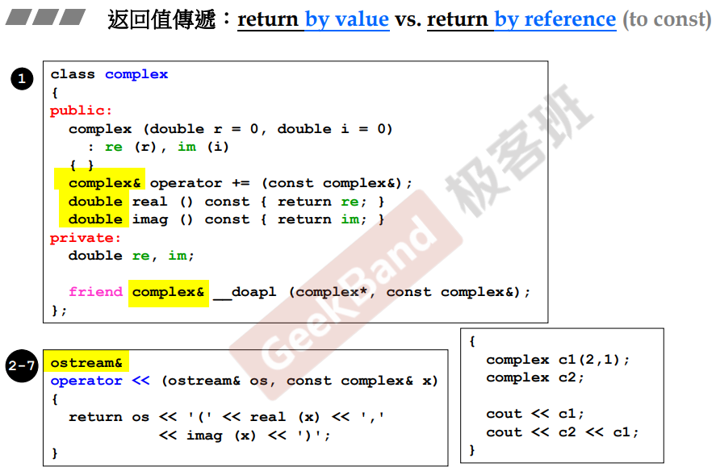
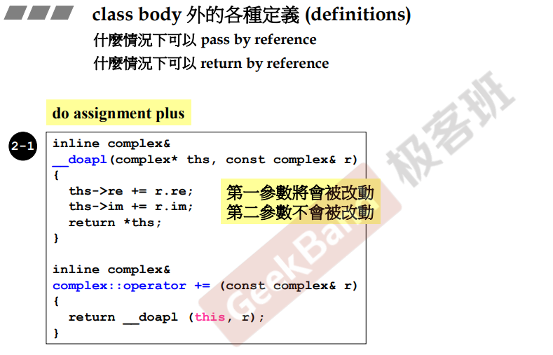

## 参数传递

### 值传递

如上图，<u>*double*</u> 的传递为值传递。

当值传递进行时，会传入到函数的栈中（后续解释），可以理解为整段的内存（整个数据包）传输到参数中（可以理解为进行一次拷贝），速度相对较慢。

### 引用（常量）传递

如上图，*<u>const complex&</u>* 的传递为常量引用传递

当引用传递进行时，只将数据的地址进行传递，一个引用只占用**四个字节（4bytes）**，速度相对较快

> **如何取舍？**
>
> 通常情况下，参数的传递一般选择常量引用传递。
>
> 若参数的类型只占用四个字节甚至更少，则两种传递方式都可以。
>
> 当需要改变传入的数据时，则需要选择引用传递（如上图 *<u>ostream&</u>*）

## 返回值

### 值返回

同样的，如上图，<u>*double*</u> 的为值返回。

当一个函数的操作结果，需要通过在函数的局部定义域中创建时，则需要使用值返回。否则在函数结束时，该对象声明周期结束，传引用则会出错（运行时）。

### 引用返回

同样的，如上图，<u>*complex&*</u> 的为引用返回。

当一个函数的操作结果，可以放入一个已有空间中，则可以首先考虑引用返回，如下图。操作的结果会放入函数第一个参数中，则可以进行引用返回。

