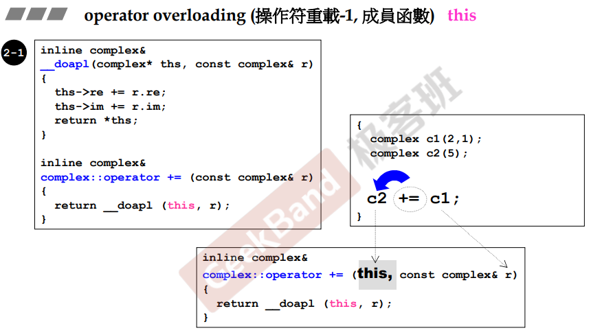
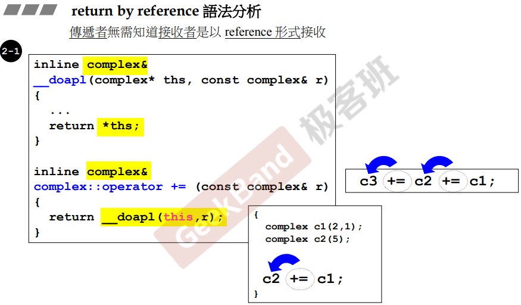
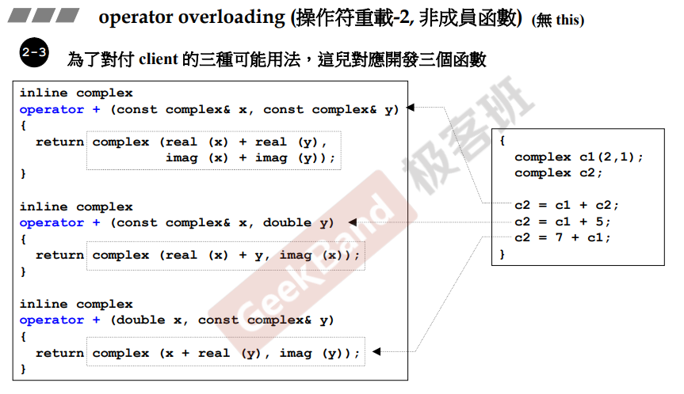
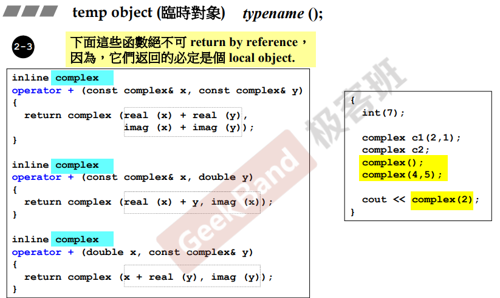
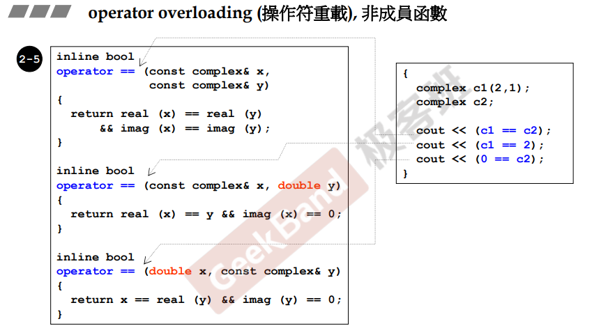
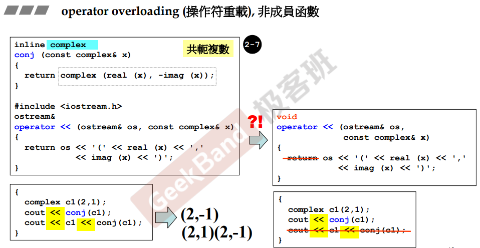

## 操作符重载

### 成员函数



**一个重要的特性：所有的类成员函数，默认都会带有一个隐藏的 <u>*this指针*</u> 参数，编译器会自动传入到类成员函数中。<u>*但是我们在编码时没必要也不能写*</u>。**

当重载操作符的函数为类成员函数时。

> 如上图，重载了一个二元操作符 <u>*+=*</u> ，由于是二元操作符，所以需要两个参数。
>
> 并且是类成员函数，参数列表中会传入 <u>*this指针*</u>，所以只需要一个参数。
>
> 在调用 += 操作符时，相当于调用一个 operator+= 的函数，并且将右边对象作为参数传入，返回值则是在 += 操作执行结束后的返回值（<u>*后续解释，用于**连续操作***</u>）。

#### 引用返回

在上述例子中， <u>*__doapl*</u> 函数返回了一个引用，这个引用是一个指针的解引用（对象）。该函数是一个在已有空间改变对象的例子，即可以进行引用返回。



同样的，对于连续的赋值，如上图：<u>*c3 += c2 += c1*</u>，**虽然说可以进行值返回，但是为了减少开销，可以使用引用返回，避免重复赋值，提高程序效率**

**注意：+= 操作符为右结合性，若强行将其使用为左结合性，例如：<u>*（c3 += c2） += c1*</u>，则会得到截然不同的结果。<u>若为引用返回，则结果为 c3 += c2; c3+= c1。若为值返回，则结果为 c3 += c2; temp += c1。</u>temp为临时对象。**

### 非成员函数



相比于类成员函数，该函数定义于全局，显而易见，也没有<u>*this指针*</u>可以使用

#### 值返回



如上图，由于 <u>*+*</u> 操作符的理解，不同于 <u>*+=*</u> 操作符，<u>*+*</u> 一般为相加两个值，而不改变值本身，最后会得到相加之后的结果。

所以根据一般理解，需要重新开辟空间，存储相加之后的结果，所以需要使用值返回。

#### 临时对象

通过 *<u>typename()</u>*，类名 + （）的方法来创建临时对象。该写法可以调用对应类的构造函数。如上图，创建<u>*complex*</u>临时对象在返回（return）出去。

<u>**注意：临时对象在创建时，若没有进行存储，生命周期在程序执行到下一行代码后结束**</u>

同理，临时对象只能被值返回，而不能被引用返回。

##### 一些特殊衍生

```C++
class Child {
public:
	Child() {
		std::cout << "Child Constructor" << std::endl;
    }
	void Func() const { std::cout << "Child Func Const" << std::endl; }
	~Child() {
		std::cout << "Child DeConstructor" << std::endl;
	}
};

int main() {
	const Child& rc = Child();
    //Child& rc = Child();  A non-const reference may only be bound to an lvalue
	rc.Func();    
}
```

在上述示例中，可以将临时对象绑定当 <u>***常量引用***</u> 中，而 <u>***非常量引用***</u> 则不行。

> 具体原因为：c++创建临时对象，当超过范围时（下一行），并且没有进行存储时，则会析构，<u>***引用并不算一种存储***</u>，所以 <u>***非常量引用***</u> 则不能够去修改，因此不能够去使用。
>
> 而 <u>***常量引用***</u> 则不同，<u>*只读操作可以被 c++ 绑定到临时对象上*</u>。
>
> <u>*这应该是 c++ 11 左右值的新特性，具体后续补充。。。。*</u>

#### 其他符号重载

##### 逻辑判断



例如逻辑判断符号 == / != ，如上图，返回的是 bool 值。

##### 位移



如上图，使用左移运算符 <u>*<<*</u> ，控制对象输出。在这种情况下，只能作为全局函数，不可能为了输出自己创建的类而去改变标准库的源码。

同样的，<u>*<<*</u> 操作符同样是个二元操作符，作用于左边的对象。在上述作为输出时，第一个参数为 <u>*cout（ostream）*</u>，第二个参数为自身对象；在函数中，需要改变第一个参数（cout），所以第一个参数是个引用而非常量引用；再返回 cout 的引用。

**注意：返回值为一个 ostream 的引用，而不是void，是为了应对连串的输出。<u><< 操作符为左结合操作符</u>。**

> 在上述的内容中，至少在侯捷老师的这堂课中，并没有介绍操作符重载时应该声明为类成员还是全局函数。
>
> 相比之下，侯捷老师更加注重的是参数的引用/值传递以及函数返回值的引用/值传递。

## 成员 / 全局

在《C++ Primer》p493 中介绍到：

> 1.<u>*赋值（=）、下标（[ ]）、调用（( )）和成员访问（->）*</u>运算符**必须是成员函数**。
>
> 2.<u>*复合赋值（+=、-=、*=、/=、%=）*</u>一般来说是**成员，但非必须项。**
>
> 3.<u>*改变对象状态的运算符或者与给定类型密切相关的运算符*</u>，例如<u>*递增（++）、递减（--）和解引用（*）*</u>，通常**应该为成员**。
>
> 4.<u>*具有对称性的运算符可能转换任意一端的运算对象*</u>，例如<u>*算数（+、-、*、/、%）、相等性（==、!=）、关系（<、>、<=、>=）和位运算（<<、>>）*</u>等，通常为**非成员函数**。

**注意：当我们把<u>*运算符定义为成员函数*</u>时，它的<u>*左侧运算对象*</u>必须是运算符<u>*所属类的一个对象（this）*</u>。**例如下端代码例子：

```C++
string s = "world";
string t = s + "!";	//正确, 可以将 const char* 加到一个 string 对象
string u = "hi" + s; //如果 + 是成员函数, 则会产生错误
```

如果 operator+ 是 string 类的成员，则第一个加法 s + "!" 为 :

```
s.operator+("!");
```

同样的，"hi" + s 为：

```
"hi".operator(s);
```

但是 char 为内置类型，没有这种加法，所以报错。

所以，根据<u>*定义为成员函数的操作符*</u>会<u>*将**左侧运算对象作为自身**传入*</u>这个条件，在上述第 4 条，**具有对称性的运算符应该作为非成员函数进行定义**。

