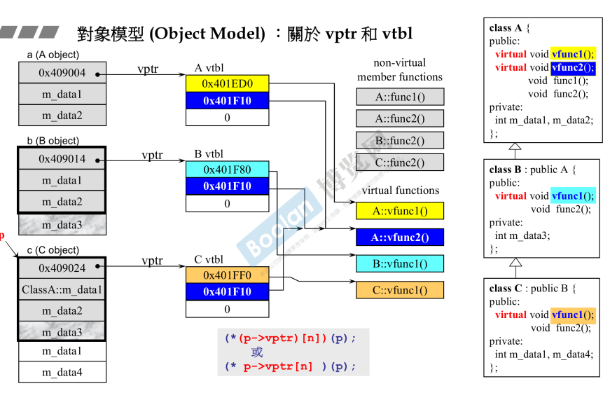
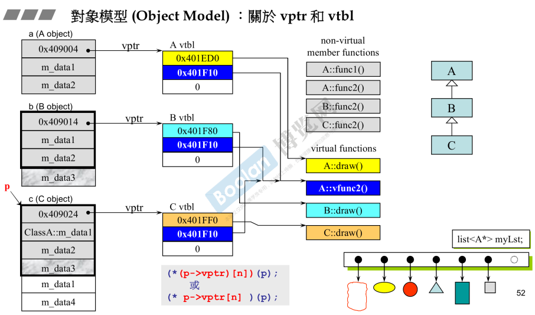

## 简介

vptr 和 vtbl

虚指针和虚表在代码层次上是看不出来的。

介绍虚指针和虚表，主要是解释类和成员函数在内存中的结构。

## 内存角度看继承

### 类成员



如上图，A <- B <- C（继承），那么每个类对应的对象中（<u>*最左边*</u>），在内存的角度，B 对象有 A 类的 part，C 对象有 B 类的 part（包括 A），<u>***子类的对象在内存中有父类的成分。***</u> [part1.11.组合与继承](../Part1/11.组合与继承)

### 虚函数

> 侯捷老师解释道：<u>*当使用继承时，通常都会搭配虚函数使用，否则继承的意义和作用不太大。*</u>

如上图：

#### 虚指针

只要类（上图类A）中有虚函数（无论多少），<u>*那么创建的对象中就会多一根指针（0x409004），这个指针称为**虚指针***</u>。<u>**注意：在继承中，不仅会继承成员（数据），*同时也会把函数给继承下来，这里的继承函数指的是继承函数的调用权，而不是内存，那么当父类有虚函数时，那么子类肯定有虚函数，一定会有一根虚指针*。**</u>

#### 虚表

如上图的继承关系中，可以得出结论：总共有 8 个函数（<u>*从左数第三列*</u>），4 个是虚函数（A 类定义，B、C 类重写），4 个非虚函数（A、B、C类定义）。

虚指针只会去关联虚函数。<u>*当一个类有虚指针（虚函数）时，这个指针将会指向一个表，称为**虚表***</u>。<u>*这个表里面存放的是指针，指向的是**虚函数所在的地址***</u>。**<u>注意：这些虚表是属于类的，而非对象的。</u>**

##### 静态绑定

在 c 语言中，编译器看到函数调用动作时，就会去执行一个特定的 CALL 指令，去调用函数的地址，这种就叫做静态绑定。

##### 动态绑定

如上图左下角，**一根指针 p（引用也可以）**，去调用虚函数时，编译器就回去动态绑定。<u>***通过指针去找到 vptr（虚指针），然后去找 vtbl（虚表），最后找到虚函数所在地址，并进行调用***</u>。这种就称为动态绑定。

如上图最下面部分

```C++
(*(p->vptr)[n])(p);
//或
(* p->vptr[n] )(p);
```

一下是虚函数调用示例代码：

```C++
class Parent {
public:
	Parent() {
		std::cout << "Parent Constructor" << std::endl;
	}
    
	virtual void Func(){
        std::cout << "Parent Func" << std::endl; 
    }
    
	~Parent() {
		std::cout << "Parent DeConstructor" << std::endl;
	}
};

class Child : public Parent {
public:
	Child() {
		std::cout << "Child Constructor" << std::endl;
	}
    
    //无论带不带 virtual，都会动态绑定
    //该类的子类也会动态绑定
	void Func() { 
        std::cout << "Child Func" << std::endl; 
    }
    
	~Child() {
		std::cout << "Child DeConstructor" << std::endl;
	}
};

class GrandChild : public Child {
public:
	GrandChild() {
		std::cout << "GrandChild Constructor" << std::endl;
	}
    
    //未进行虚函数 virtual 声明, 由于继承了函数调用权（虚指针）,依然为虚函数
	void Func() { std::cout << "GrandChild Func" << std::endl; }
	~GrandChild() {
		std::cout << "GrandChild DeConstructor" << std::endl;
	}
};

int main()
{
    GrandChild g;
	Child c;
    
	Parent* p = &c;
	p->Func();
    
	Parent& r = c;
	r.Func();
    
    Parent* pg = &g;
	pg->Func();
}
//GrandChild 构造
//Parent Constructor
//Child Constructor
//GrandChild Constructor

//Child 构造
//Parent Constructor
//Child Constructor

//Child Func （指针进行虚函数调用时动态绑定）
//Child Func （引用进行虚函数调用时动态绑定）
//GrandChild Func 

//Child DeConstructor
//Parent DeConstructor

//GrandChild DeConstructor
//Child DeConstructor
//Parent DeConstructor
```

###### <u>*构造函数*</u> 和 <u>*析构函数*</u> 不能动态绑定

如下示例代码：

父类 Parent 调用虚函数 Func 试图进行动态绑定。

在 main 函数中创建 child 对象，在构造时会默认调用父类的构造函数，但是在调用 Func 时，并没有进行动态绑定，而是调用父类 Parent 的实现。

```C++
class Parent {
public:
	Parent() {
		std::cout << "Parent Constructor" << std::endl;
		Func();	//试图进行动态绑定
	}
	virtual void Func(){ std::cout << "Parent Func" << std::endl; }
	~Parent() {
		std::cout << "Parent DeConstructor" << std::endl;
         Func(); //试图进行动态绑定
	}
};

class Child : public Parent {
public:
	Child(){
		std::cout << "Child Constructor" << std::endl;
	}
	void Func() { std::cout << "Child Func" << std::endl; }
	~Child() {
		std::cout << "Child DeConstructor" << std::endl;
	}
};

int main()
{
    Child child;
}
//Parent Constructor
//Child Constructor
//Parent Func	(并未进行动态绑定)

//Child DeConstructor
//Parent DeConstructor
//Parent Func	(并未进行动态绑定)
```

> 深层的原因在于：
>
>  <u>*一个类在构造时，必然**先调用其父类的构造函数，然后是自身成员变量的构造函数**；析构时顺序则恰好相反，**先析构自身成员，再析构父类**。*</u>  [9.复合&继承关系下的构造和析构](9.复合&继承关系下的构造和析构) 和 [part1.11.组合与继承](../Part1/11.组合与继承)
>
> 当 Child::Child 调用 Parent::Parent 时，**child 自身的成员变量尚未初始化 （如果此时允许调用它的岂不是要让程序崩溃）** ，child 此时还是一个（正在初始化的）Parent 对象。所以在构造时，Func 会进入 Parent::Func。
>
> 那么析构函数也是同样的道理，child 自身成员已被析构，此时是一个（正在析构的）Parent 对象。所以在构造时，Func 会进入 Parent::Func。

## 使用方面



如上图，同样使用三各类 A<-B<-C，并且定义了各种虚函数。

在使用时（<u>*右下角*</u>），**在容器中放入一个<u>*元素类型为父类指针的容器*</u>，<u>*指向不同子类创建的对象*</u>**。

在调用时，**通过取出容器中的指针，调用虚函数时，则会去调用对应对象的实现**（这里表现为<u>*draw()*</u>函数）。

**这种用法就称之为多态。**

> 动态绑定的条件：
>
> 1.必须通过 **指针/引用** 调用虚函数
>
> 2.指针/引用 是 **up-cast，向上转型**（保证类型安全）
>
> 3.调用的必须是**虚函数**

