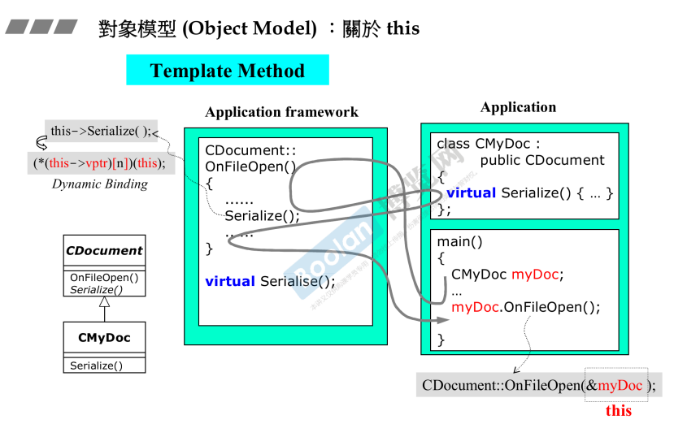

## 简介

在 [part1.10.一些补充](../Part1/10.一些补充) 中简单提到了 this 指针。

简单来说，<u>*通过对象调用一个函数，对象的地址就是 this 指针*</u>。

在这里介绍一个特例：<u>*模板方法*</u>，让这个特例**解释一下 this 指针是如何调用虚函数**。

## 虚方法调用

这个图在 [part1.12.虚函数与多态](../Part1/12.虚函数与多态) 出现过，是一种名叫模板方法的设计模式。

在 [part1.5.操作符重载与临时对象](../Part1/5.操作符重载与临时对象) 介绍到：<u>*通过对象调用类成员方法时，编译器会帮我们将 this 指针作为参数传入成员函数中*</u>；

另外，在 [part1.10.一些补充](../Part1/10.一些补充) 在<u>*成员函数中获取成员/调用别的成员函数时，前面会默认使用this指针*</u>。

所以，在上图中，调用 <u>Serialize</u> 函数时（虚函数），其实前面还有一个**隐藏的 this-> 指针**，那么，就会进行动态绑定（[part2.10.虚指针和虚表](Part2/10.虚指针和虚表)），调用了对应对象类型的实现。