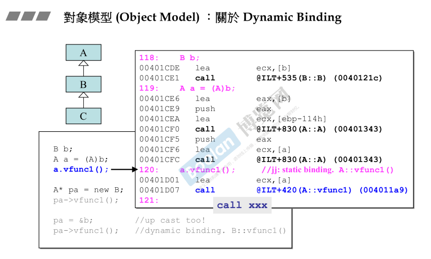
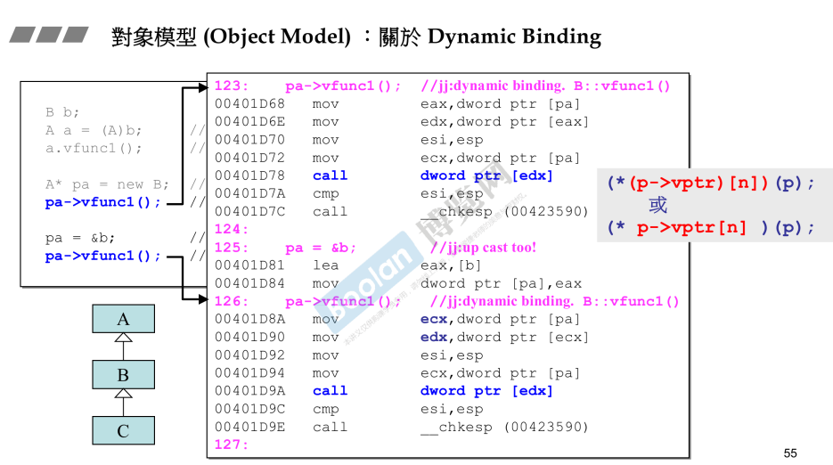

## 简介

在 [part2.10.虚指针和虚表](10.虚指针和虚表) 中，<u>*介绍了动态绑定的实现以及使用条件*</u>。

在本节课中，侯捷老师站在汇编的角度来解释动态绑定的底层运行逻辑。

## 静态绑定



如上图，同样使用 A<-B<-C 的类继承结构。

在这里通过

```C++
B b;
A a = (A)b;
a.vfunc1();
```

一个强制转换，将对象 b 强制向上转换为类型为 A 的对象 a。

那么此时通过 a 调用虚函数 vfunc1() 时，<u>*是调用的哪一个类的虚函数呢？*</u>

其实答案显而易见，[part2.10.虚指针和虚表](10.虚指针和虚表) 介绍了动态绑定的三个条件，<u>*首先**必须是个指针/引用去调用虚函数**，而上述是个对象，所以是静态绑定。*</u>

通过汇编可以看到：

> 编译器将 c++ 代码进行翻译，翻译 a.vfunc1(); 时：
>
> ​	**调用的是 call 指令，并且后面是固定的地址**，这个指令就是<u>***调用某个函数，是个静态绑定。***</u>

## 动态绑定



如上图，这里通过

```C++
A* pa = new B;
pa->vfunc1();

pa = &b;
pa->vfunc1();
```

指针去调用虚函数，并且是向上转型，所以调用虚函数时是动态绑定。

可以看到汇编部分：

> 在翻译 pa->vfunc1(); 时：
>
> ​	调用的同样是 **call 指令，但是后面不再是个地址**，这一段解析出来其实是<u>*灰色打底部分的 c 语言注解*</u>，其实就是<u>***通过调用虚指针找到虚表中的函数地址，然后进行调用。***</u>

