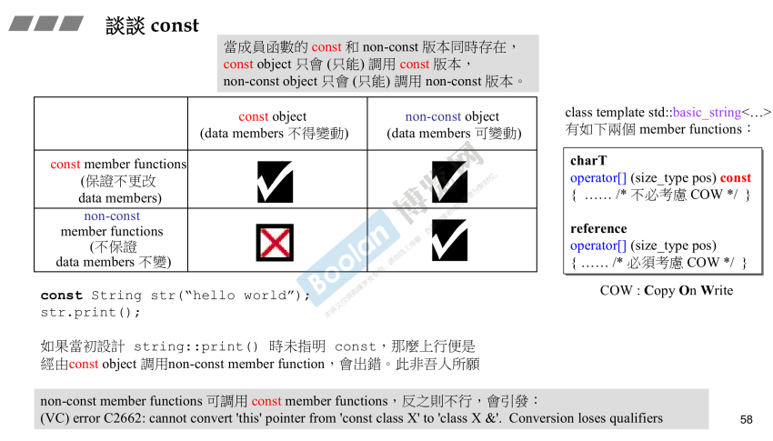

## 简介

在 [part1.4.类成员函数简介](../Part1/4.类成员函数简介) 中，简单介绍了 *<u>const</u>* <u>*成员函数*</u>的用法。

在本节课程中，会更加深入的去讲解const。

## const 对象

如上图，const 对象的意义为：<u>*成员（data members）不能改变（行头）*</u>。

而在成员函数中声明为 const，意思为<u>*保证不改变成员变量。*</u>

所以，如上图的列表：

> **const 对象**只能去<u>*调用 **const 成员函数**。*</u>
>
> 而 **非 const 对象** <u>*既可以调用 **const 成员函数**，又能够调用 **非 const 成员函数**。*</u>

### const成员函数意义

如上图下半部分，当调用 string 类的使用者只需要调用 print 方法时，不改变对象数据的情况下，只将对象声明为 const 即可。

若类成员函数 print 没有使用 const 声明，则会编译不通过。

这就是一种设计上的缺陷，是很有必要的。

#### 延申用法

如上图最右部分，重载 [] 操作符，并且进行了多次重载，在 [part2.8.引用](8.引用) 中的 <u>函数签名标签下</u> 提到，<u>*const 作为修饰成员函数时可以视作签名的一部分，所以可以进行重载。*</u>

> *那么为什么要重载两次 [] 操作符呢？*

这就要提到在 [part1.11.组合与继承](../Part1/11.组合与继承) 中的 <u>委托标签下</u> 提到的**共享概念**：

> 当多个对象共享同一段内存时（例如 string，使用的引用计数的一种设计），当执行**写操作**时，为了不影响其他的引用者，那么，就需要拷贝一份作为己用。（<u>*若没有其他使用者则不需要拷贝*</u>）

那么，上述的重载 [] 操作符中，区分了两种情况：

> 1.读操作，则重载为 const 成员函数。
>
> 2.写操作，需要考虑COW（copy-on-write）

这样的重载方式会导致：

> 1.当调用 [] 的对象是一个 **const 对象**，所以就去**会调用 const 成员函数**。
>
> 2.**非 const 对象**调用 [] 操作符时，**应该去执行非 const 成员函数**。

> **这样子会有一个问题：**
>
> const 对象只能调用 const 成员函数，这个是没问题的。
>
> <u>*但是 非 const 对象却可以调用 const 和 非 const 成员函数，那么编译器会调用哪个版本呢？*</u>

**注意：如上图<u>*最上面的灰色打底部分*</u>，<u>当成员函数中有 const 版本和 非 const 版本时，const 对象只会调用 const 版本；而非 const 对象值会调用 非 const 版本</u>。**