## 简介

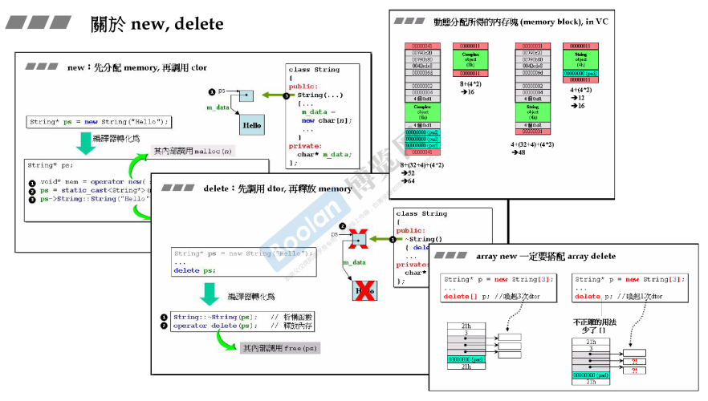

在 [part1.8.堆、栈与内存管理](../Part1/8.堆、栈与内存管理) 的<u>堆分配标签下</u>，介绍了 new 和 delete的分解动作。

如上图，new 分为：

> 1.operator new（分配内存，malloc）
>
> 2.类型转换
>
> 3.类构造函数

delete 分为：

> 1.调用析构函数
>
> 2.operator delete（释放内存，free）

不仅如此，也介绍了<u>*动态分配的内存大小，以及array delete*</u>。

那么在本节课程中，侯捷老师将去<u>*更深层次的介绍 new 和 delete 的用法，比如重载。*</u>

## 重载 operator new / delete

### 全局 operator new / delete

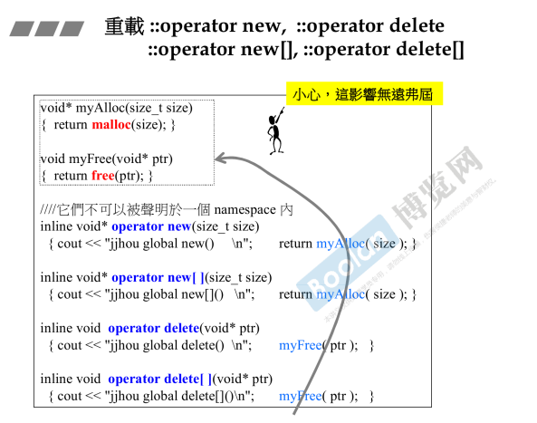

如上图，重载全局的 operator new / delete 操作。

**<u>注意：该操作其实不是使用者去调用，而是在 new / delete 时的时候去调用。</u>**

如上图

> 在重载这些操作时，同样是调用 **malloc / free** 去分配 / 释放内存
>
> **operator new** 则是<u>*接收一个参数 size*</u>，表示分配内存块的大小，<u>*调用malloc 去分配内存*</u>，并且<u>*返回指向分配内存块的首地址指针*</u>。
>
> **operator delete** 则是<u>*接收指向内存块首地址的指针*</u>，<u>*调用free去释放内存*</u>。

*具体的编译器如何去 分配 / 释放 相关内存，可以看  [part1.8.堆、栈与内存管理](../Part1/8.堆、栈与内存管理) 的 <u>动态分配内存的大小</u> 标签。*

### 成员函数 operator new / delete

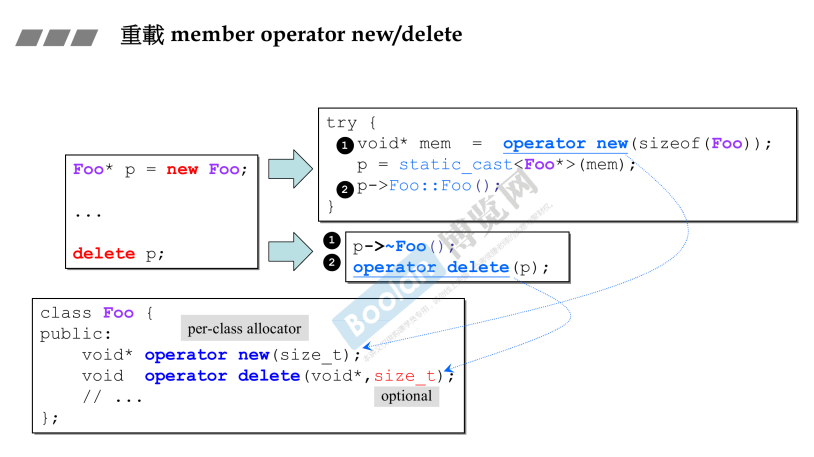

如上图，跟全局重载类似。

在使用者去动态分配一个 Foo 类的对象时，在<u>*编译器执行 operator new / delete 时，则会去调用该类的重载。*</u>

operator new[] / delete[] 也是同理，如下图：

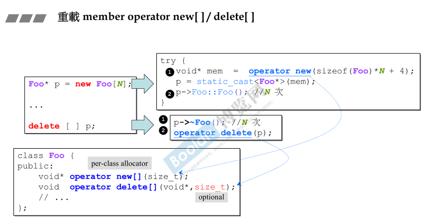

> <u>*这里有个疑问，+ 4 是为什么？*</u>
>
> 根据 [part1.8.堆、栈与内存管理](../Part1/8.堆、栈与内存管理) 的 <u>*数组分配*</u> 标签下，会<u>***多出四个字节，去存储当前数组的大小（size）***</u>，所以<u>*分配内存大小时除了要分配够对象的个数，并且需要多分配四个字节来存储大小*</u>。

### 示例

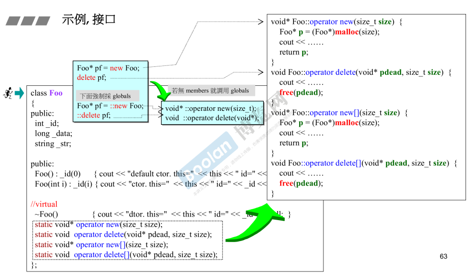

如上图，这是完成的从设计到使用的示例。

> <u>*这里无论是否设计为 static 应该都没关系吧？*</u>

**注意：这里有个语法上的特殊使用，<u>*如上图蓝色打底*</u>，若写法为**

```C++
Foo* pf = ::new Foo;
::delete pt;
```

**则会去调用全局的实现。这只是一个特例，语法上提供这样的使用方式。**

该例子运行的结果如下：

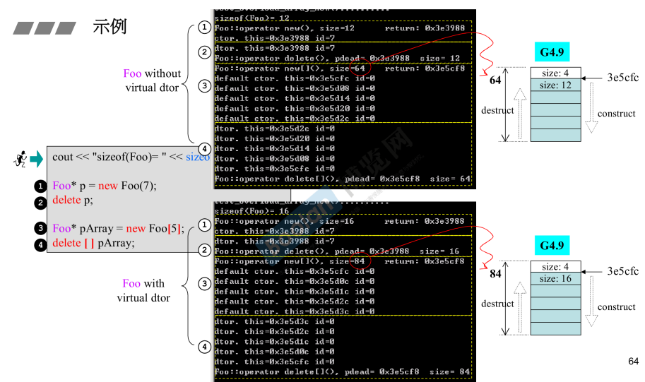

这里给出定义：<u>*一个 Foo 类型的对象占用 12 个字节*</u>。

这里需要注意的是：当使用 operator new[] 生成一个数组时，<u>*如上图，生成一个 5 个元素的数组，那么**分配的内存应该为 60，但实际上不是**。*</u>

> 在不含有虚函数时（虚指针），所以该类的内存大小应该为 12，所以分配五个元素的数组应该为 60，<u>***另外，还需要 4 个字节，作为一个 counter，记录数组元素的个数。***</u>
>
> 侯捷老师介绍到，这是编译器的操作（vc）

这个 counter 是有必要的，<u>*在调用 array 分配（new[] / delete[]） 时，编译器**通过 counter** 来很快的知道需要调用多少次 构造 / 析构 函数*</u>。

另外，下图是调用全局的 operator new / delete 的例子，不多赘述。

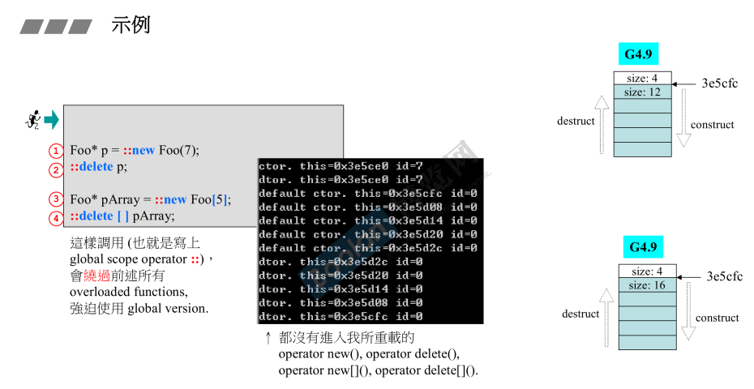

## 重载 new() / delete()

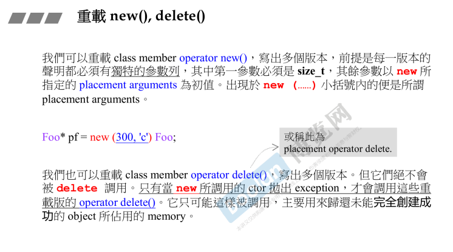

如上图，对于成员的 operator new / delete()：

> 可以写出很多版本。
>
> 每一个版本都有独特的参数列，并且**第一个参数必须是 size_t**，其余参数可以是自定义的参数。

如下图，<u>*Foo 类重载了四个 operator new() 函数*</u>，并且每个版本的**第一个参数必是 size_t**，其余自定义。

这种类型的被称为 <u>***placement new***</u>

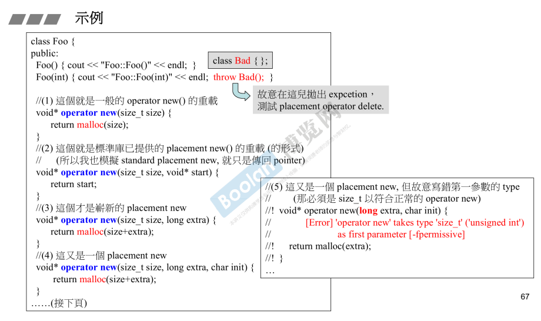

那么，在调用时：

```C++
Foo* pf = new(300, 'c')Foo;
```

该调用其实是调用了三个参数的 operator new()，根据例子为：

```C++
void* operator new(size_t size, long extra, char init);
```

<u>***因为编译器在调用 operator new 时，会将 size 默认传入第一参数，其余依次传入。***</u>

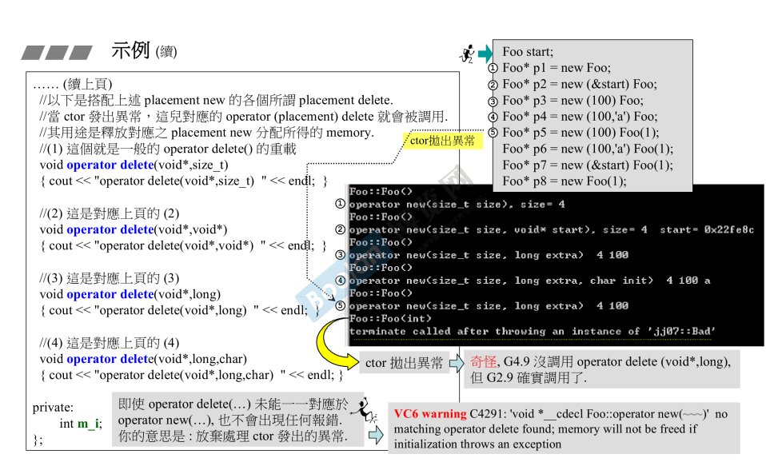

如上图，关于多版本的 operator delete()，<u>*这些版本应该与 operator new() 的版本对应*</u>。

这些版本在调用的时机只有一个，<u>*在调用对应版本的operator new() 结束后，**调用构造函数发出异常时**，对应的 operator delete() 则会被调用起来*</u>。

## 示例

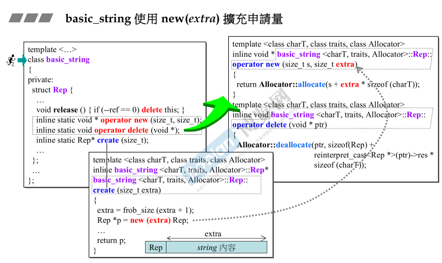

如上图，这是标准库 base_string 对 <u>*placement new*</u> 的使用示例。

当使用 create(size_t); 时，会去调用 operator new(size_t size, size_t extra); 。

这个动作会额外分配 Rep 之外的 extra 的大小。而真正的 string 就是放在 extra 中，前面的 Rep 其实是为了做引用计数。

> 当想要多分配一些内存时，可以考虑 placement new