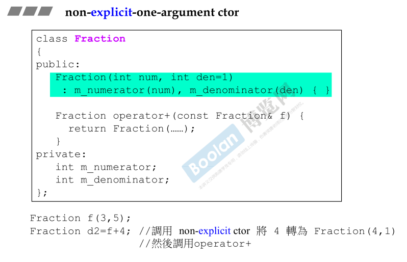
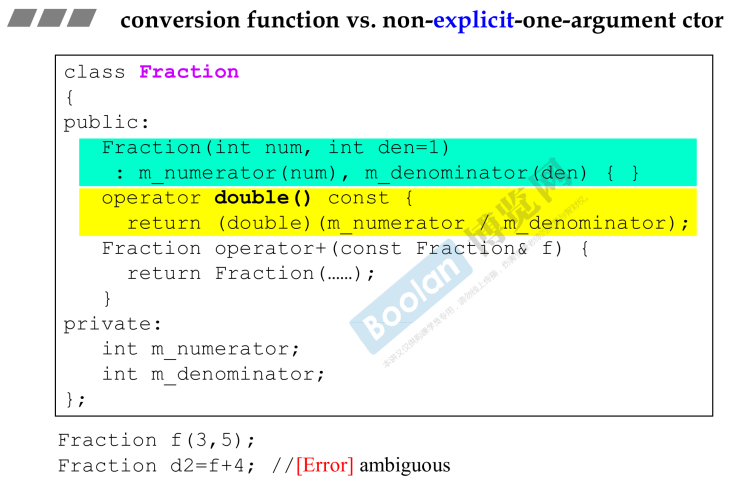
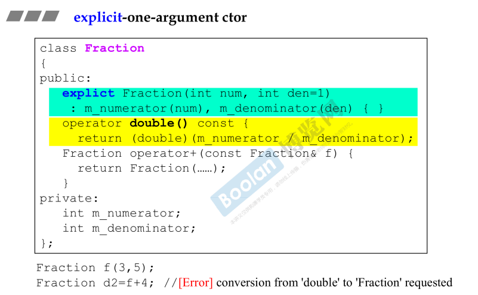
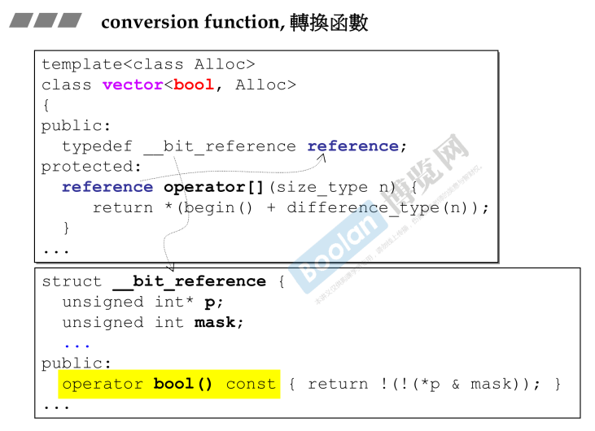

## 简介

转换函数，就是将一个类型的对象转换为另一种类型，或者从另一个类型转变为该类型。

## 转换函数 conversion function

如上图，这是一个 Fraction （分数）类，该类作为有理数，转换为 double 类型也很合理，所以做出黄色部分的转换函数：**operator double() const;** <u>*（不一定是基本类型，也可以是其他）*</u>

该函数**不用传参数和返回值**（<u>*避免转换类型和返回值类型不同，编译器为了防止错误，直接不允许写*</u>）。

在调用时，如上图的 double d = 4 + f; 在该过程中，编译器做了以下事情：

> 1.首先去寻找**是否定义了全局的 operator + 操作符**，确认是否有 Fraction + float/int/double 类型。
>
> 2.然后再去**寻找有没有转换函数**，将 Fraction 类转换为 double 类型。

## non-explicit-one-argument

如上图，Fraction 类的<u>*构造函数是一个**非 explicit** 并且**只需要一个实参**的函数。*</u>（绿色部分）

同时还重载了 operator+ 操作符。

在转换函数解释过，当编译器在看到一个语句时，需要去寻找相关定义。例如 Fraction d2 = f + 4，编译器做了以下操作：

> 1.<u>*首先寻找 + 这个动作*</u>，在 Fraction 中。
>
> 2.但是在 + 这个动作时，需要的参数是一个 Fraction 类， + 4 显然与设计不同。
>
> 3.于是去<u>*寻找 4 能否转换为 Fraction，于是找到了绿色部分，将 4 转换为了 Fraction 类*</u>。

于是，这种 non-explicit-one-argument 的构造函数可以将其他类转换为该类。

### 与转换函数对比

如上图，当转换函数 operator double() 和 n-e-n-a（简称）并存时，有以下两种情况：

> 1.<u>*将 4 转换为 Fraction*</u>，两个Fraction相加，可行
>
> 2.<u>*将 f 转换为 double，两个 double 相加，发现可以转为Fraction*</u>，也可行

于是出现歧义，编译器报错。

### explicit-one-argument

在构造函数中加入 **explicit** 关键字，因此不会将 int 类型转换为 Fraction 类型。

因此，编译器在编译语句 Fraction d2 = f + 4 时，<u>*会将 f 转为 double，然后相加；但是因为**构造函数为 explicit**，所以**相加的结果不能转换为 Fraction**，导致编译器报错*</u>。

### 延申

如上图，这是一个标准库的例子，在 vector<bool, Alloc> 这个模板类中的 **operator []** 函数中，应该取出的是一个 bool 值，但是在这个例子中取出的却是一个 <u>*_bitreference 数据类型，因此，这个数据类型需要有一个转换函数，转换为 bool 类型（黄色部分）*</u>。

这种设计手法称为 proxy （代理）。

