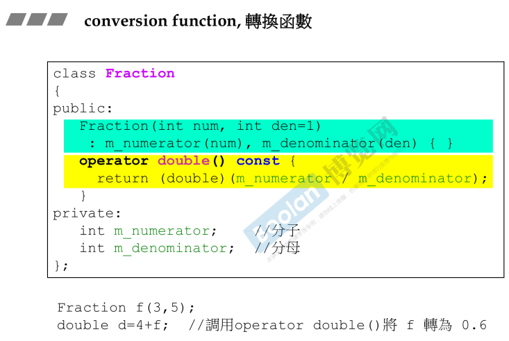

## 简介

转换函数，就是将一个类型的对象转换为另一种类型，或者从另一个类型转变为该类型。

## 转换函数

如上图，这是一个 Fraction （分数）类，该类作为有理数，转换为 double 类型也很合理，所以做出黄色部分的转换函数：**operator double() const;** <u>*（不一定是基本类型，也可以是其他）*</u>

该函数**不用传参数和返回值**（<u>*避免转换类型和返回值类型不同，编译器为了防止错误，直接不允许写*</u>）。

在调用时，如上图的 double d = 4 + f; 在该过程中，编译器做了以下事情：

> 1.首先去寻找**是否定义了全局的 operator + 操作符**，确认是否有 Fraction + float/int/double 类型。
>
> 2.然后再去**寻找有没有转换函数**，将 Fraction 类转换为 double 类型。