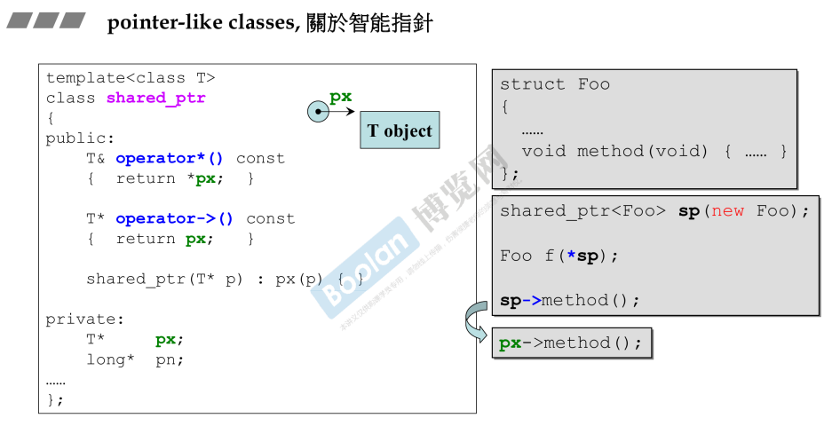
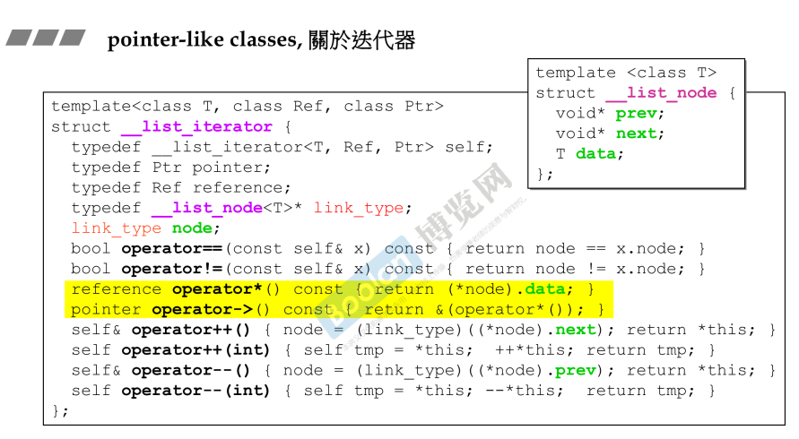
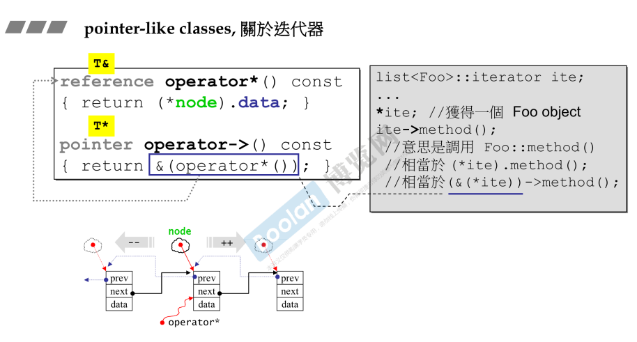

## 简介

一个 c++ 的类，可能会像两种东西，一种是<u>*创建这个类的对象时，这个对象的行为像一个指针；另外一种则是像一个函数。*</u>

## 智能指针

在这里举一个例子，用来表达一个行为像指针的对象。如下图，智能指针。**并不介绍作用，只介绍语法方面。**

从上图可以看到，智能指针类 （shared_ptr）想要完成类似指针的行为，那么需要**<u>用到指针常用的操作符</u>**，分别是 **<u>*</u>** 和 **<u>-></u>** ，（解引用和箭头操作符）。

从用法上来说（上图右侧），构造的时候需要让成员指向一段在堆上分配的内存；在调用成员/成员函数时，需要跟指针一样使用箭头操作符（->）；或者解引用（*）取得内存对象。

> 1.使用解引用时，如上图的 Foo f(\*sp)，<u>* 作用于 sp，得到的结果为重载 operator*() 的结果，**得到指针指向的对象**。</u>
>
> 2.使用箭头操作符时，sp->method()，<u>-> 作用于 sp，得到 px（绿色），本来不应该有箭头，但由于箭头符号比较特别，需要继续用箭头符号作用上去</u>。（感觉有点强行解释，感觉侯捷老师有点抠细节了，了解即可）。

## 迭代器

迭代器的作用主要是用来遍历容器，并且它的行为也像一个指针，但比智能指针不同的是，**多了 ++ -- 操作**，如下图。

如上图，关于双向链表的迭代器，node（绿色）指针指向的是一个链表节点。跟智能指针同理，对于迭代器的使用者而言，<u>*使用解引用符号时，则会取得链表的对象（data）*</u>；<u>*箭头符号*</u>类似，如上图右半部分，要满足调用 Foo::method 的意图，<u>由于 data 不是个指针成员，所以在重载箭头操作符时需要多一步取引用的操作（**return &(operator\*())**）</u>

