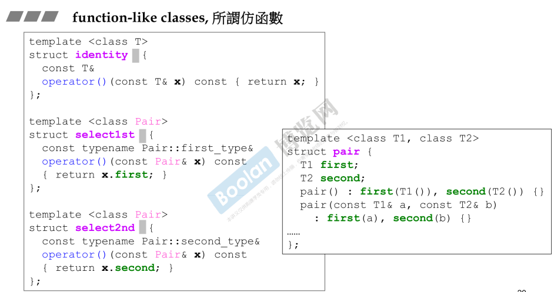
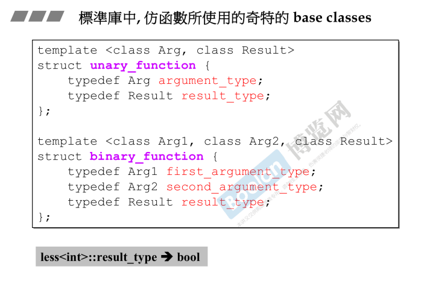

## 简介

这节课的主题，是为了让一个类的行为像一个函数。

至于为什么要把一个类的行为像一个函数/指针，侯捷老师说无法一言以蔽之，只是说先介绍语法😓。

如何像一个函数？函数就是一个函数名 + ()，在这里，<u>*()为函数调用操作符（function call），那么一个类重载了()，即可以在行为上像函数*</u>。

## 仿函数 functor

如上图左半部分，三个类均对 () 操作符进行重载，那么他们的行为可以像函数。

**注意：在对象创建时，也有一个 ()，但这是创建临时对象使用的，并不是函数操作符；往后再加一个()，才是函数操作符。**

### 一些补充

在标准库的仿函数中，几乎所有都继承自上面的两个类。

这两个类非常特殊，在理论上，这两个类的大小是0，但有可能在使用sizeof之后会变成1，侯捷老师没有过多解释。

## 总结

> 在本次课程中，侯捷老师介绍了标准库中很多关于仿函数相关的类，但是没有过多的去解释。
>
> 突出的重点便是：**当一个类重载了 () 函数操作符，他的行为就可以像函数**。