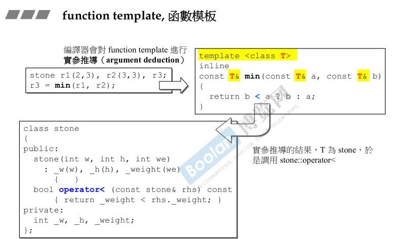

## 简介

本节是对之前提到的模板（**类模板、函数模板**）的使用做更详细的介绍和解释。

在模板这一节中，除了上述两套模板，还添加了**成员模板**。

这一节可能跨越的课程会比较多（可能是视频分太多p了？），所以文档会相对较长。

**注意：编译器在编译模板时，是不知道模板真正的类型是什么，是不能保证后面使用的正确性。<u>*当模板被真正使用后，编译器会对使用部分再编译一次*</u>。**

## 类模板


在之前的课程中，如上图，在 [part1.2.头文件与类声明简介](../Part1/2.头文件与类声明简介) 和 [part1.10.一些补充](../Part1/10.一些补充) 中简单介绍了模板类，意为在类中的成员可以为各种类型，便可以声明一个模板类（<u>*上半部分黄色*</u>），在使用时再确定使用的类（<u>*下半部分黄色*</u>）。

## 函数模板



在 [part1.10.一些补充](../Part1/10.一些补充) 中，介绍了函数模板，与类模板的概念一样，都是为了各种不同的类能使用。

与模板类不同的是，在使用时，类模板需要指定类型，而函数模板在使用时，不必指明类型，在调用模板函数时，编译器会执行以下操作，以上图为例：

> 1.调用min，先确定参数类型，确认参数的类为 stone
>
> 2.函数体中，min 的操作为 < 比较，编译器会去寻找该类的 < 比较定义，在这个例子中为 stone 类的 operator< 操作符。

## 成员模板

### pair


如上图，使用 pair 做例子。成员模板为<u>*上图黄色部分*</u>：**这一块是模板类中的一个成员，并且这个<u>成员自身是一个模板</u>**。即在 T1 T2被确定后，U1 U2还能继续被确定。


以上图的pair为例，先维护一套继承关系（<u>*左上角*</u>），这里将这些继承关系分为 鱼类->鲫鱼 以及 鸟类->麻雀（<u>*右上角*</u>）。

在成员模板被使用时（<u>*左下角*</u>），可以将一个由 **pair<Derived1, Derived2>()**（鲫鱼，麻雀的pair）**作为参数**，**放入到**一个 **pair<Base1, Base2>()**（鱼类，鸟类的pair）中。

在<u>*右下角*</u> pair 的成员模板中，**其实是将传入的 pair 的 first, second（头尾）作为自身的头尾**，那么在上述例子中，**由于 <u>*Derived1 继承自 Base1，Derived2 继承自 Base2，所以是可以进行转换*</u>的**。那么也回答了<u>*左下角*</u>的问题：<u>这样传参是可以的，反之则不行。</u>

### 智能指针


再看一个例子，在智能指针中，也有成员模板。同理，如<u>*下半部分*</u>的使用，智能指针**为了模拟 up-cast** （向上转型），使用了和pair一样的成员模板操作。

## 模板特化

模板是一种泛化，只是简单声明一个类型，在使用时在确定；那么**模板特化（specialization）与泛化相反，<u>*在使用特殊的类型时，有一些特殊的设计*</u>**，这就成为特化。


如上图，在 hash 为泛化（<u>*上半部分*</u>）。

那么，在 hash 被特化后，他的写法就为

```C++
template<>
struct hash<char>{};
```

可以理解为：class Key 被绑定，所以 template 后的参数为空。所以，**当使用者将 hash 的类型定义为 char / int / long 时，编译器则会去执行已被特化部分的代码**（<u>*下半部分*</u>）。

如当使用者

```c++
cout << hash<long>(1000);
```

时，<u>***编译器先去寻找 hash 的泛化版本，然后发现有类型为 long 的特化版本后，则去使用这个被特化后的版本。***</u>

## 模板偏特化

偏特化，指的是在泛型中，参数个数的偏，或者说范围上的偏（后者比较难理解）。

### 个数的偏


如上图，类 vector 是一个泛化模板类，有两个参数。

那么在语法上，通过指定第一个参数（<u>*下半部分，T ----> bool*</u>），那么就是实现了一种偏特化。

**注意：个数的偏特化，只能从左到右，不能跳着偏。例如 5 个参数，只特化 1 3 5，这样是不行的。**

### 范围的偏


如上图，如果设计为类型 T，<u>若需要特化 T 的指针版本 T*</u>，那么c++也会支持这种想法。

那么通过将其特化为指针版本后，使用者在将类型定义为一个指针时，编译器则会去使用指针偏特化的版本。

## 模板模板参数

看上去很绕😓，其实这里的意思是指：**将一个模板作为模板参数。**


如上图<u>*黄色部分*</u>，这是一个模板参数，但是它同时也是一个模板。<u>***注意：只有在template<>尖括号里面的各个参数，才能将typename和class共通，可以随意使用。***</u>

那么，在使用上，如同<u>*灰色部分*</u>，传入一个元素类型，并且传入一个容器。

**注意：在使用部分，第一行打了一个❌，因为<u>*容器 list 中有第二个模板参数，平时使用时没有写，因为他有默认值*</u>；但是在作为模板模板参数传入时，必须像 <u>*中间部分*</u> 那样，这是 c++2.0 新增语法（暂时不介绍），才能正常使用。**

> <u>*侯捷老师解释这里不需要注意这个❌，只需要注意黄色部分以及标题之间的关系即可。*</u>

### 这不是模板模板参数


如上图stack的实现，第二个模板参数为 class Sequence = dequeue<T>，但是这个参数其实不是模板模板参数，原因是在使用时（<u>*灰色部分*</u>），**传入的参数已经不再是一个模板**，所以这不是一个模板模板参数。

