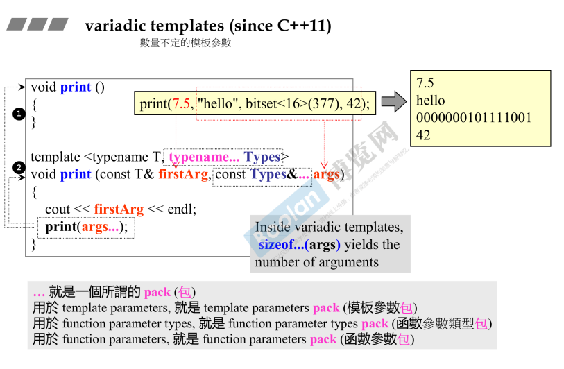
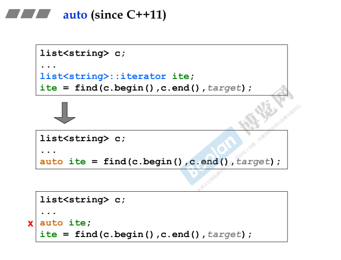
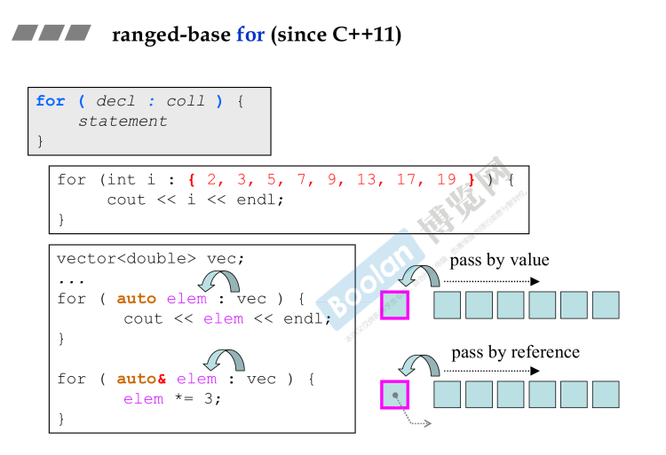

## variadic templates

variadic 在英文中是没有这个单词的，在这里意为**可变化**的意思，所以这个主题的意思是：<u>***可变化的模板参数***</u>



如上图，在语法角度上。

> **模板定义层面**："**typename... Types**" 可以让模板接收多个模板参数。
>
> **参数获取层面**："const **Types&...** args"，在上图的例子中可以让模板函数获取**参数包**。
>
> **参数使用层面**：在上图中，通过命名参数包为 args，在使用时 print(**args...**); 

**详细解释：如上图的 print 函数中，通过参数包，递归调用 print() 函数，来输出每一个参数。**

> 另外，通过 **sizeof...(args)** 来获取参数的个数。

下面为具体实现：

```c++
/*
* 注意：
* 无参数版本也要实现
* 否则调用到最后一个函数时，args的大小为0，则会失败
* 所以需要实现该无参版本
*/
void PrintArgs() {
}

template<typename T, typename... Type>
void PrintArgs(const T& firstArg, const Type&... args) {
	std::cout << firstArg << std::endl;
	std::cout << sizeof...(args) << std::endl;
    
    //递归调用
	PrintArgs(args...);
}
```

## auto



如上图，使用 **auto** 关键字，可以避免像以前的 c++ 那样写很长一串的类型名（<u>*蓝色*</u>），<u>*这是一个语法糖*</u>，作用是让编译器帮我们去识别**返回值的类型**。

**注意：使用 auto 时，必须能够让编译器能够帮我们推理出类型，否则不能使用（<u>*最下面的❌*</u>）**

> 侯捷老师说过，在清楚类型只是不想写，或者实在写不出类型（lambda）时，可以使用auto
>
> 初学者不建议无脑使用auto

## ranged-base for （范围for）

同样也是一个语法糖。



如上图，范围for循环的语法为

```C++
for( decl : coll ) {
    //statement
}
```

这个语法的作用是让编译器在遍历一个 **集合** 时，<u>*将遍历到的每一个元素复制到左侧的变量中*</u>，如上图<u>*遍历容器*</u>，可以获取容器的每个元素；<u>*当然，也有引用传递和值传递的区别*</u>。