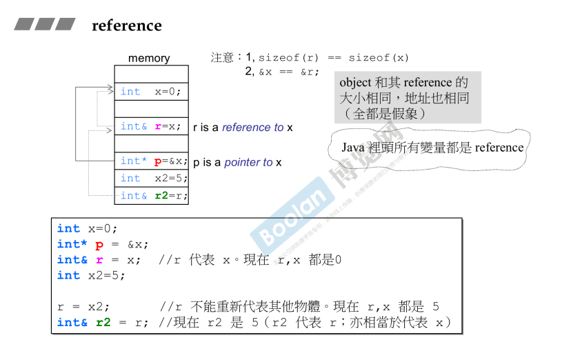
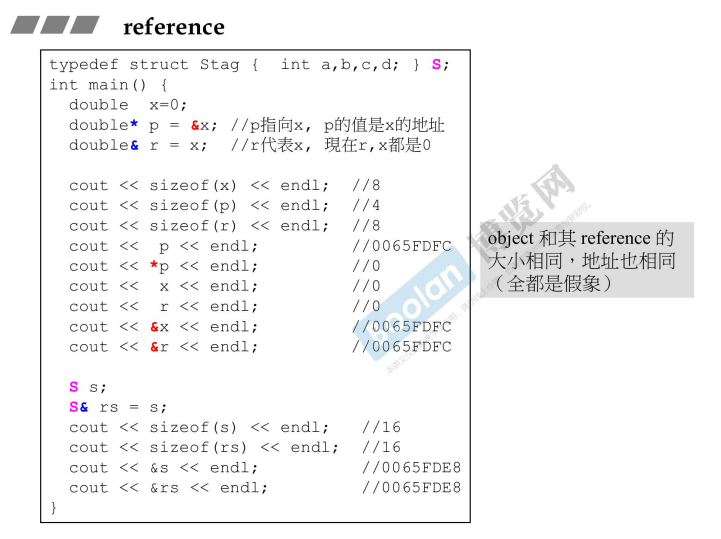
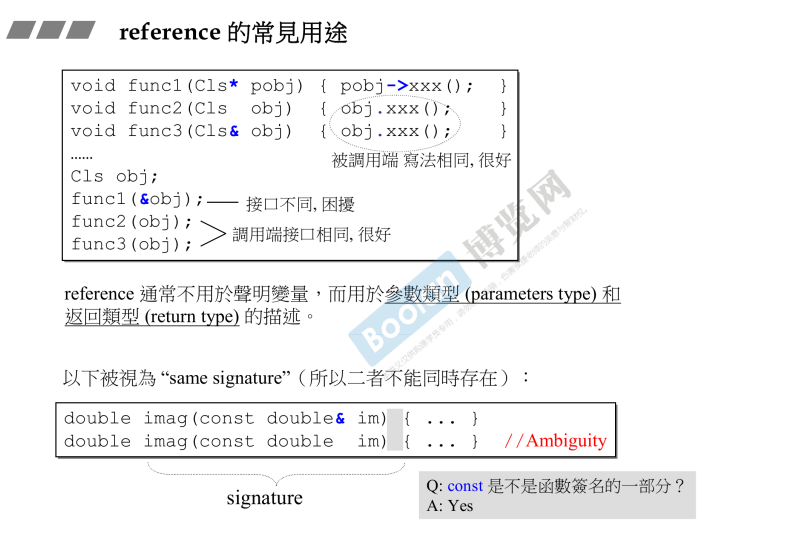

## 简介

通常来说，变量分为三种：值、指针和引用。

在本节课程中，侯捷老师将从内存的角度去谈到**引用（reference）**

## 内存角度



如上图，<u>*根据下半部分的代码，引出了上半部分各个变量的内存结构*</u>。

### 变量

1.首先是声明（定义）一个 **int 类型变量** x ：

```C++
int x = 0;
```

那么它在内存中会有一个独立的空间，用来存放这个 int 类型变量，大小为 4 个字节。

### 指针

2.然后是声明（定义）了一个 **int 类型<u>*指针*</u>变量** p ：

```C++
int* p = &x;
```

这个指针 p 指向了 x 的内存地址（&）。

同理，p 也是个变量，在 32 位的操作系统中，指针占用 4 个字节。

### 引用

3.接着是声明（定义）了一个 **int 类型<u>*引用*</u>变量** r ：

#### 定义

**<u>注意：引用必须要有初值。</u>**

```C++
int& r = x;
```

引用的意义：如上图，**从变量（逻辑）的角度看**，跟指针不同，<u>*指针 p 是指向 x，那么变量 p 就是一个地址；引用 r 是指代表 x，那么变量 r 就是 x，即为 0*</u>。

**从内存的角度看**，侯捷老师说，无论是什么编译器，<u>***引用是依托于指针来实现***</u>（<u>*如上图，r 有一根淡淡的线指向 x，意思为有一根指针*</u>），所以和指针一样，在内存中是一个地址。

<u>**注意：另外，引用不能再去代表其他变量：**</u>

```C++
int x2 = 5;
r = x2;
```

*<u>这时，如果让 r 去赋值，r 并不会去代表 x2，而是将 x2 的值赋给 x。</u>*

#### 引用的引用

那么，同样的，当**声明（定义）一个<u>*引用的引用*</u> **时：

```C++
int& r2 = r;
```

引用是一种代表，那么 <u>*r2 代表了 r，r 代表了 x，所以其实是 r2  也代表 x*</u>。

#### 引用的大小

在内存中，<u>*引用的大小取决于被代表变量的大小*</u>（其实不然）。

> 在这里侯捷老师解释道，<u>*引用的底层实现是指针，所以实际大小应该和指针相同，为 4 个字节*</u>。
>
> 但是，<u>*编译器制造了一种假象*</u>，<u>让 x 的大小和 r 的大小相同 **sizeof(x) == sizeof(r)**，并且地址相同 **&r == &x**</u> （如上图）

## 详细测试



可以看到：<u>*引用无论是地址、大小都跟被引用者相同，实际上是编译器做的假象*</u>。

## 常见用途



侯捷老师称：引用（reference）是一种漂亮的指针（pointer）

### 参数传递

如上图，引用的常见用途：**引用一般作为函数的参数进行传递**。在 [part1.3.类成员函数参数传递和返回值](../Part1/3.类成员函数参数传递和返回值) 中解释过。

那么在用法上（<u>*上图上半部分*</u>）：

> 1.在函数体中进行使用时，与值传递的写法相同，不像指针需要使用箭头操作符 (->)
>
> 2.在参数传递时，指针传递需要传递一个地址，而引用传递和值传递的写法相同
>
> 另外，<u>*引用传递和值传递除了调用和使用相同外，就是速度会比较快*</u>（[part1.3.类成员函数参数传递和返回值](../Part1/3.类成员函数参数传递和返回值) ），<u>*并且写法上相同（区别于指针）*</u>

### 返回值

与上述的参数传递类似，不做赘述，注意事项可以参考 [part1.3.类成员函数参数传递和返回值](../Part1/3.类成员函数参数传递和返回值)

### 函数签名

<u>*如上图下半部分*</u> ：

```C++
double imag(const double& im) {...}
double imag(const double im) {...}
```

这两个函数被编译器视为相同的函数，**不能同时重载**

```C++
double a = 0.0;
imag(a);
```

当调用时，编译器不知道应该去调用哪个函数，会引起歧义（ambiguity），所以不能重载。

**注意：const 用<u>*作修饰参数*</u>时，不算做函数签名的一部分；但是用于<u>*修饰成员函数*</u>时，可以算作签名的一部分（<u>如以下部分代码</u>）。**

[Part1.4.类成员函数简介](../Part1/4.类成员函数简介) 中介绍了**const成员函数**

```C++
//可以重载
//对象为 const 则会去调用 const 成员函数
double imag(const double im) const{...}
double imag(const double im) {...}
```

## 指针的引用

```C++
int a = 0;
int* p;
int*& rp = p;
```

> <u>*如上述例子，p 为一个整形的指针，那么 rp 为什么呢？*</u>

当不确定变量的类型时，可以从<u>***右往左读***</u>，（选自 《c++ primer》p53），<u>***离变量名最近的符号对变量类型有最直接的影响***</u>，所以 rp 是一个引用，并且指向 int*。

```C++
rp = &a;
*rp = 1;
```

如上述例子，通过指向引用的指针，<u>*可以改变指针本身*</u>（改变指针的指向）。

**<u>注意：只有指向指针的引用，没有指向引用的指针</u>**，如下面的例子。

```C++
int&* pr = &a; //error
```

> <u>*c++ 不允许定义引用的指针，因为引用本身只是与另一个对象绑定在一起（引用代表某个对象），而并非一个对象，所以不能定义。*</u>

