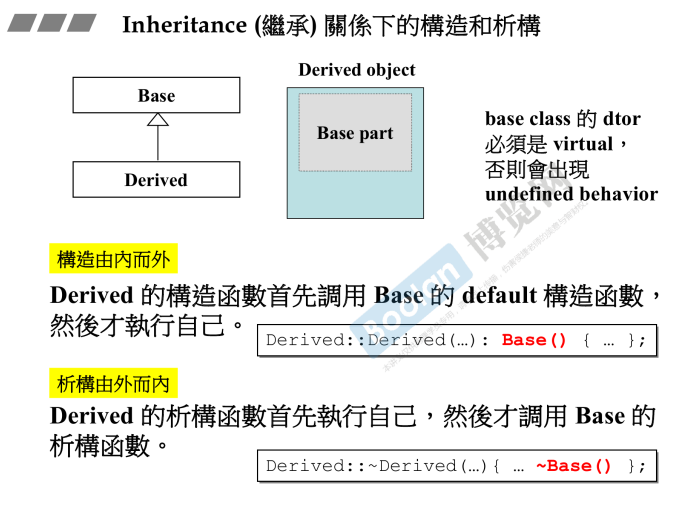
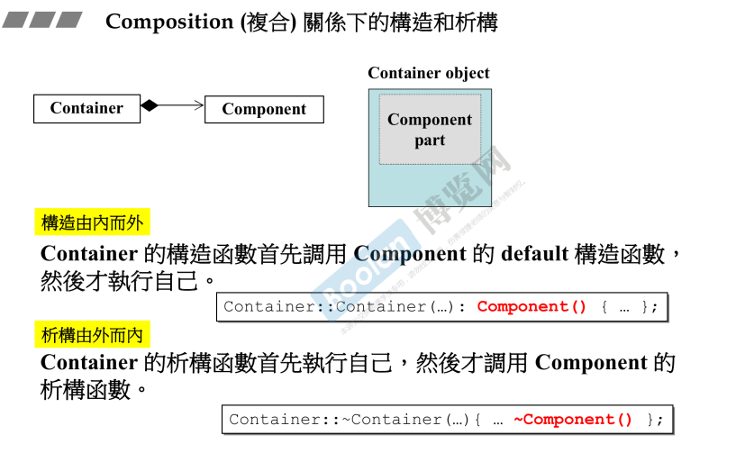
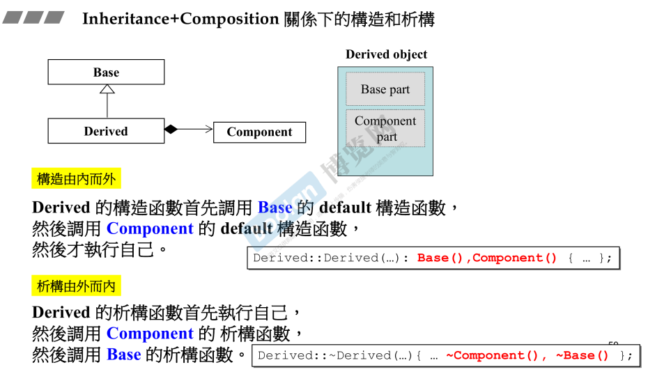
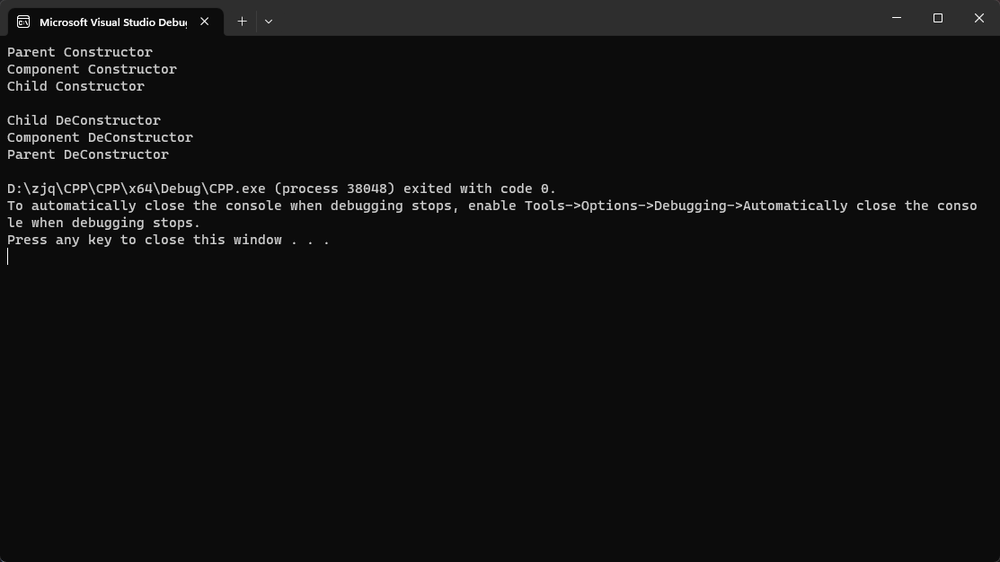

## 简介

在 [part1.11.组合与继承](../Part1/11.组合与继承) 和 [part1.12.虚函数与多态](../Part1/12.虚函数与多态) 分别介绍了 <u>**组合**和**继承**关系下构造和析构函数各个类的执行顺序，并且说明了当**组合和继承同时存在**时这两个函数应该如何执行</u>。

这里重新介绍了一次。

**<u>重点为：构造由内而外，析构由外而内。</u>**

## 继承



[part1.11.组合与继承](../Part1/11.组合与继承)

构造函数：先执行父类，再执行子类。

析构函数：先执行子类，再执行父类。

## 组合



[part1.11.组合与继承](../Part1/11.组合与继承)

构造函数：先执行内部组件，再执行外部容器。

析构函数：先执行外部容器，再执行内部组件。

## 继承 + 组合



[part1.12.虚函数与多态](../Part1/12.虚函数与多态)

在这里与上述文章有所不同。侯捷老师解释过：<u>*c++的规格书中没有介绍过谁先执行，只是在编译器中的实现不同。**即使次序不同，也不影响整个c++语法的一致性，也不会造成矛盾***</u>。

所以上图只是介绍了侯捷老师使用的编译器的情况。

这里笔者使用的是 visual studio，执行如下代码：

```C++
class Child : public Parent {
private:
	Component ChildComponent;

public:
	Child() {
		std::cout << "Child Constructor" << std::endl;
	}

	~Child() {
		std::cout << "Child DeConstructor" << std::endl;
	}
};

int main()
{
	Child c;
    std::cin.get();
}
```

发现运行结果为（如下图）：

> 构造函数：父 -> 被组合 -> 子
>
> 析构函数：子 -> 被组合 -> 父

